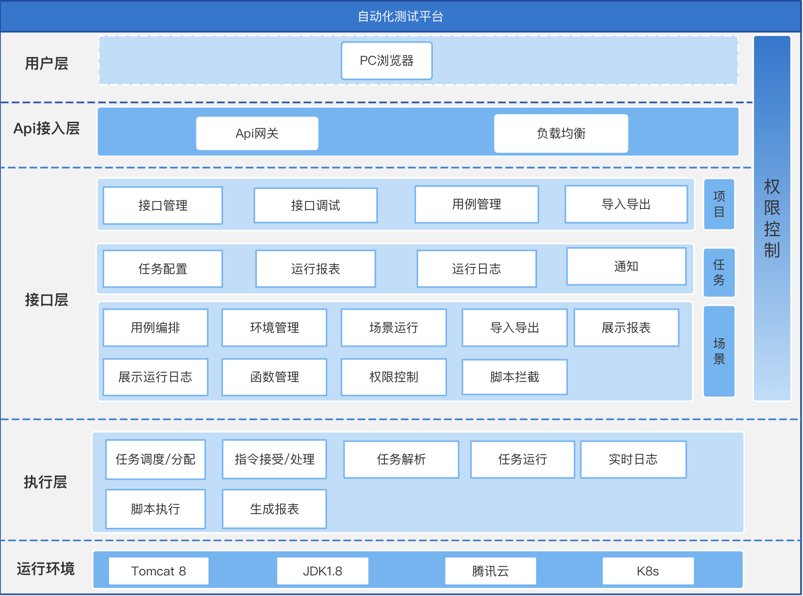

# Auto Test Engine


## Introduction
This project is mainly used in interface automation as an execution engine. It includes the following functions.
- Supports scenario-based multi-interface orchestration, loop control, delay controller, parameter transmission and other functions.
- Supports pre-pre-post-assertion operations on interfaces.
- Support embedded Lua scripts, and support http, SQL, JSON serialization and deserialization operations inside the script.
- Support real-time log query, history log query and other functions.
- Currently, only the http transport protocol is supported, and GRPC is planned.
- NACOS is supported as a registry.



## Usage

### Start program

Dowload `auto-test-engine` project and build it.

```bash
sh-3.2# https://github.com/gy09535/autotest.git
sh-3.2# go build -o ./output/auto-test-engine  ./cmd/engine/main.go
sh-3.2# mkdir database
sh-3.2# chmod 777 ./output/auto-test-engine database
sh-3.2# ./output/auto-test-engine
```

Besides, you may pass a customized configuation while running a `auto-test-engine`. Supported
environment parameters are listed below,

| ENV              | Description                                   | Default |
|------------------|-----------------------------------------------|---------|
| NACOS_ADDRESS    | The addresses of nacos(support http protocol) | NIL     |
| NACOS_PORT       | Nacos port                                    | NIL     |
| NAMESPACE        | Nacos namespace                               | NIL     |
| MAX_TASK_COUNT   | Max async command count, beyonds will reject  | 1000    |


## Eexcute APIs

### Use case sync command

Simultaneous execution of a single use case, including pre-action (Lua script), assertion (Lua script), post-action (Lua script)

```bash
curl --location --request POST 'http://127.0.0.1:8090/api/v1/user-case/command/receive-single-sync' \
--header 'Content-Type: application/json' \
--data-raw '{"userCase":{"name":"use_case","id":1,"request":{"name":"","headers":null,"protocol":"","method":"GET","body":"","url":"https://@host/demo/mock/latbox-test","timeout":30},"isReplace":false,"parameters":[{"name":"id","value":"1","pType":""},{"name":"name","value":"zhangSan","pType":""},{"name":"age","value":"15","pType":""},{"name":"host","value":"your_host","pType":""}],"taskId":"","PreScripts":[{"scriptType":"ScriptType_LuaScript","script":{"luaScript":"print(ctx.name) \n  print(ctx.message)","type":"LuaFuncType_DoBaseExecute"},"Order":2},{"scriptType":"ScriptType_LuaScript","script":{"luaScript":"ctx.name='\''wangWu'\''","type":"LuaFuncType_DoBaseExecute"},"Order":1},{"scriptType":"ScriptType_LuaScript","script":{"luaScript":"  local response, error_message = http.get(\"https://host:port/mock\")\n  if error_message  then\n       print(\"http request call fail:\" .. error_message)\n    end\n    if response.body ~=nil and response.status_code==200 then\n       local my_body = json.decode(response.body)\n         ctx.message = my_body.message\n    else\n        print(\"response code is :\" .. response.status_code .. \", url: https://your_host/mock/latbox-test\")\n   end","type":"LuaFuncType_DoHttpRequest"},"Order":0},{"scriptType":"ScriptType_SqlScript","script":{"luaScript":"  local resp, err = c:query(\"SELECT * FROM some_table WHERE  service_name='\'''\''\")\n   if err then\n      add_log(ctx, err)\n   else\n         for i = 1, #resp do\n    ctx.rows = json.encode(resp[i])   add_log(ctx,'\''sql: '\'' .. json.encode(resp[i]))  \n   end \nend","type":"LuaFuncType_DoSqlExecute","host":"mysql_dbhost","port":"mysql_dbport","userName":"username","password":"password","dbName":"dbname"},"Order":4},{"scriptType":"ScriptType_SqlScript","script":{"luaScript":"  local resp, err = c:query(\"update some_table set project_id =1  WHERE  id = 191\")\n   if err then\n      add_log(ctx, err)\n   else\n         for i = 1, #resp do\n    ctx.rows = json.encode(resp[i])   add_log(ctx,'\''sql: '\'' .. json.encode(resp[i]))  \n   end \nend","type":"LuaFuncType_DoSqlExecute","host":"mysql_dbhost","port":"mysql_dbport","userName":"username","password":"password","dbName":"dbname"},"Order":5}],"afterScripts":[{"scriptType":"ScriptType_LuaScript","script":{"luaScript":"add_log(ctx,'\''http response by after script:'\'')","type":"LuaFuncType_DoBaseExecute"},"Order":1}],"assert":{"luaScript":"add_log(ctx,'\''http response code: '\'' .. code) \n add_log(ctx,'\''http response data: '\'' .. resp) \nctx.assert=false","type":"LuaFuncType_AssertUserCase"}},"id":"1000","commandType":"Execute","name":"test command"}'
```

Since the use case entity contains a lot of content, it cannot be expanded in full, please see the full test code for more content(path: `./cmd/test/main.go:userCaseTest()`).

### Use case async command

Same as sync command just change the path,

```bash
curl --location --request POST 'http://127.0.0.1:8090/api/v1/user-case/command/receive-single-async' \
--header 'Content-Type: application/json' \
--data-raw '{"userCase":{"name":"use_case","id":1,"request":{"name":"","headers":null,"protocol":"","method":"GET","body":"","url":"https://@host/demo/mock/latbox-test","timeout":30},"isReplace":false,"parameters":[{"name":"id","value":"1","pType":""},{"name":"name","value":"zhangSan","pType":""},{"name":"age","value":"15","pType":""},{"name":"host","value":"your_host","pType":""}],"taskId":"","PreScripts":[{"scriptType":"ScriptType_LuaScript","script":{"luaScript":"print(ctx.name) \n  print(ctx.message)","type":"LuaFuncType_DoBaseExecute"},"Order":2},{"scriptType":"ScriptType_LuaScript","script":{"luaScript":"ctx.name='\''wangWu'\''","type":"LuaFuncType_DoBaseExecute"},"Order":1},{"scriptType":"ScriptType_LuaScript","script":{"luaScript":"  local response, error_message = http.get(\"https://host:port/mock\")\n  if error_message  then\n       print(\"http request call fail:\" .. error_message)\n    end\n    if response.body ~=nil and response.status_code==200 then\n       local my_body = json.decode(response.body)\n         ctx.message = my_body.message\n    else\n        print(\"response code is :\" .. response.status_code .. \", url: https://your_host/mock/latbox-test\")\n   end","type":"LuaFuncType_DoHttpRequest"},"Order":0},{"scriptType":"ScriptType_SqlScript","script":{"luaScript":"  local resp, err = c:query(\"SELECT * FROM some_table WHERE  service_name='\'''\''\")\n   if err then\n      add_log(ctx, err)\n   else\n         for i = 1, #resp do\n    ctx.rows = json.encode(resp[i])   add_log(ctx,'\''sql: '\'' .. json.encode(resp[i]))  \n   end \nend","type":"LuaFuncType_DoSqlExecute","host":"mysql_dbhost","port":"mysql_dbport","userName":"username","password":"password","dbName":"dbname"},"Order":4},{"scriptType":"ScriptType_SqlScript","script":{"luaScript":"  local resp, err = c:query(\"update some_table set project_id =1  WHERE  id = 191\")\n   if err then\n      add_log(ctx, err)\n   else\n         for i = 1, #resp do\n    ctx.rows = json.encode(resp[i])   add_log(ctx,'\''sql: '\'' .. json.encode(resp[i]))  \n   end \nend","type":"LuaFuncType_DoSqlExecute","host":"mysql_dbhost","port":"mysql_dbport","userName":"username","password":"password","dbName":"dbname"},"Order":5}],"afterScripts":[{"scriptType":"ScriptType_LuaScript","script":{"luaScript":"add_log(ctx,'\''http response by after script:'\'')","type":"LuaFuncType_DoBaseExecute"},"Order":1}],"assert":{"luaScript":"add_log(ctx,'\''http response code: '\'' .. code) \n add_log(ctx,'\''http response data: '\'' .. resp) \nctx.assert=false","type":"LuaFuncType_AssertUserCase"}},"id":"1000","commandType":"Execute","name":"test command"}'
```

For more APIs usage, refer to test cases(`./cmd/test/main.go:userCaseTest()`) and API docs(to do).

### Query execute result
Only asynchronous use case directives support query functionality, synchronous directives do not support queries due to direct return results. By default, permanent queries are supported within 1w of single-node query data, queries within half an hour between 1w and 1000w, and timeliness is not guaranteed for data exceeding 1000w.

````bash
curl --location --request GET 'http://127.0.0.1:8090/api/v1/user-case/command/query-single-async/1000'
````

## Scenario Case

Scenario-based execution supports multiple use case orchestration execution, result transmission, failure continuation, loop control, wait control, and multi-level nesting.
### Sync

Synchronous execution not only supports returning the execution result after the entire scene is executed, but if there are many orchestration cases, it will wait for a long time, which is not recommended.

> Note: Process orchestration requires the design of the entire process, as shown in the following code.

````xml
<?xml version="1.0" encoding="utf-8"?>
<scenario-flow>
    <user-case case-id="1" case-name="helloword" order="1" />
    <user-case case-id="2" case-name="helloword" order="2" />
    <time-wait-case wait-time="1" order ="3" />
    <script-case script-id ="1" script-type ="ScriptType_LuaScript" order="4"/>
    <loop-script-case loop-type="LoopType_Data" data-id="1" loop-id="2"> 
        <user-case case-id="1" case-name="helloword" order="1" />
        <user-case case-id="2" case-name="helloword" order="2" />
        <time-wait-case wait-time="1" order ="3" />
        <loop-script-case loop-type="LoopType_Normal" data-id="1" loop-count="1" order="4" loop-id="3"> 
            <user-case case-id="1" case-name="helloword" order="1" />
            <user-case case-id="2" case-name="helloword" order="2" />
            <time-wait-case wait-time="1" order ="3" />
        </loop-script-case>
    </loop-script-case>
</scenario-flow>
````
Complete request example,

```bash
curl --location --request POST 'http://127.0.0.1:8090/api/v1/scenario-case/command/receive-single-sync' \
--header 'Content-Type: application/json' \
--data-raw '{"id":"100","commandType":"Execute","name":"test command","scenariorCase":{"id":1,"name":"preside","parameters":[{"name":"id","value":"1","pType":""},{"name":"name","value":"zhangSan","pType":""},{"name":"age","value":"15","pType":""},{"name":"host","value":"127.0.0.1:9080","pType":""}],"design":"\u003c?xml version=\"1.0\" encoding=\"utf-8\"?\u003e\n\u003cscenario-flow\u003e\n    \u003cuser-case case-id=\"1\" case-name=\"helloword\" order=\"1\" /\u003e\n    \u003cuser-case case-id=\"2\" case-name=\"helloword\" order=\"2\" /\u003e\n    \u003ctime-wait-case wait-time=\"1\" order =\"3\" /\u003e\n    \u003cscript-case script-id =\"1\" script-type =\"ScriptType_LuaScript\" order=\"4\"/\u003e\n    \u003cloop-script-case loop-type=\"LoopType_Data\" data-id=\"1\" loop-id=\"2\"\u003e \n        \u003cuser-case case-id=\"1\" case-name=\"helloword\" order=\"1\" /\u003e\n        \u003cuser-case case-id=\"2\" case-name=\"helloword\" order=\"2\" /\u003e\n        \u003ctime-wait-case wait-time=\"1\" order =\"3\" /\u003e\n        \u003cloop-script-case loop-type=\"LoopType_Data\" data-id=\"1\" loop-count=\"\" order=\"\" loop-id=\"3\"\u003e \n            \u003cuser-case case-id=\"1\" case-name=\"helloword\" order=\"1\" /\u003e\n            \u003cuser-case case-id=\"2\" case-name=\"helloword\" order=\"2\" /\u003e\n            \u003ctime-wait-case wait-time=\"1\" order =\"3\"/\u003e\n        \u003c/loop-script-case\u003e\n    \u003c/loop-script-case\u003e\n\u003c/scenario-flow\u003e\n","userCases":{"1":{"name":"preside","id":1,"request":{"name":"","headers":null,"protocol":"","method":"GET","body":"","url":"https://@host/demo/mock/latbox-test","timeout":30},"parameters":[{"name":"id","value":"1","pType":""},{"name":"name","value":"zhangSan","pType":""},{"name":"age","value":"15","pType":""},{"name":"host","value":"127.0.0.1:9080","pType":""}],"preScripts":null,"afterScripts":null,"assert":{"luaScript":"add_log(ctx,'\''http response code: '\'' .. code) \n add_log(ctx,'\''http response data: '\'' .. resp) \nctx.stop=false","type":"LuaFuncType_AssertUserCase","host":"","port":"","userName":"","password":"","dbName":""},"isSkipError":false},"2":{"name":"preside","id":2,"request":{"name":"","headers":null,"protocol":"","method":"GET","body":"","url":"https://@host/demo/mock/latbox-test","timeout":30},"parameters":[{"name":"id","value":"1","pType":""},{"name":"name","value":"zhangSan","pType":""},{"name":"age","value":"15","pType":""},{"name":"host","value":"127.0.0.1:9080","pType":""}],"preScripts":null,"afterScripts":null,"assert":{"luaScript":"add_log(ctx,'\''http response code: '\'' .. code) \n add_log(ctx,'\''http response data: '\'' .. resp) \nctx.stop=false","type":"LuaFuncType_AssertUserCase","host":"","port":"","userName":"","password":"","dbName":""},"isSkipError":false}},"baggages":{"1":{"Id":0,"Data":["name1","name2"]}},"scripts":{"1":{"scriptType":"ScriptType_LuaScript","script":{"luaScript":"ctx.name='\''wangWu'\''","type":"LuaFuncType_DoBaseExecute","host":"","port":"","userName":"","password":"","dbName":""},"Order":0,"isSkipError":false}},"preScripts":[{"scriptType":"ScriptType_LuaScript","script":{"luaScript":"print(ctx.name) \n  print(ctx.message)","type":"LuaFuncType_DoBaseExecute","host":"","port":"","userName":"","password":"","dbName":""},"Order":2,"isSkipError":false}],"afterScripts":[{"scriptType":"ScriptType_LuaScript","script":{"luaScript":"add_log(ctx,'\''http response by after script:'\'')","type":"LuaFuncType_DoBaseExecute","host":"","port":"","userName":"","password":"","dbName":""},"Order":1,"isSkipError":false}]}}'
```

The scenario-based data response is displayed in the form of a link, one node contains the context information of the current use case, each context contains the ID information of the parent node, and the parent node of the root node is 0,

```bash
{"code":200,"message":"","data":{"Self":{"parentId":0,"variables":{"CURRENT_ROW":{"Value":"name2","Object":null,"Type":""},"age":{"Value":"15","Object":null,"Type":""},"host":{"Value":"127.0.0.1:9080","Object":null,"Type":""},"id":{"Value":"1","Object":null,"Type":""},"inner_log":{"Value":"","Object":null,"Type":""},"name":{"Value":"zhangSan","Object":null,"Type":""},"stop":{"Value":"false","Object":null,"Type":""}},"caseName":"ScriptType_LuaScript","caseId":"1","id":0,"taskId":"1","logs":["2023-01-11 10:33:00 [ScenarioCaseExecute] User case pre script ordered: [{\"scriptType\":\"ScriptType_LuaScript\",\"script\":{\"luaScript\":\"print(ctx.name) \\n  print(ctx.message)\",\"type\":\"LuaFuncType_DoBaseExecute\",\"host\":\"\",\"port\":\"\",\"userName\":\"\",\"password\":\"\",\"dbName\":\"\"},\"Order\":2,\"isSkipError\":false}]","2023-01-11 10:33:00 [CaseScriptHandleRegister] Current user case script build success,function name: do_base_execute_1_1,scripts: function add_log(ctx, log)\n     if not ctx then\n         print(log)\n        end\n\n        if not ctx.inner_log then\n              ctx.inner_log = ''\n         end\n         ctx.inner_log = ctx.inner_log .. log .. '\\n'\n         print(log)\nend\n\nfunction inner_function_do_base_execute_1_1(ctx)\n    local json = require(\"json\")\n    print(ctx.name) \n  print(ctx.message)\n end\n\n function do_base_execute_1_1(ctx)\n    if type(ctx) ~= 'table' then\n        print('input ctx is not a table, can not execute function')\n        return\n    end\n\n    local json = require(\"json\")\n  --  add_log(ctx ,'script input ctx is:' .. json.encode(ctx))\n    inner_function_do_base_execute_1_1(ctx)\n    return ctx\nend\n","2023-01-11 10:33:00 [CaseScriptHandleRegister] Begin to execute Function name: do_base_execute_1_1, script: function add_log(ctx, log)\n     if not ctx then\n         print(log)\n        end\n\n        if not ctx.inner_log then\n              ctx.inner_log = ''\n         end\n         ctx.inner_log = ctx.inner_log .. log .. '\\n'\n         print(log)\nend\n\nfunction inner_function_do_base_execute_1_1(ctx)\n    local json = require(\"json\")\n    print(ctx.name) \n  print(ctx.message)\n end\n\n function do_base_execute_1_1(ctx)\n    if type(ctx) ~= 'table' then\n        print('input ctx is not a table, can not execute function')\n        return\n    end\n\n    local json = require(\"json\")\n  --  add_log(ctx ,'script input ctx is:' .. json.encode(ctx))\n    inner_function_do_base_execute_1_1(ctx)\n    return ctx\nend\n, parameters: {\"age\":{\"Value\":\"15\",\"Object\":null,\"Type\":\"\"},\"host\":{\"Value\":\"127.0.0.1:9080\",\"Object\":null,\"Type\":\"\"},\"id\":{\"Value\":\"1\",\"Object\":null,\"Type\":\"\"},\"inner_log\":{\"Value\":\"\",\"Object\":null,\"Type\":\"\"},\"name\":{\"Value\":\"zhangSan\",\"Object\":null,\"Type\":\"\"}}","2023-01-11 10:33:00 [ScriptInnerLog]","2023-01-11 10:33:00 [LuaScriptHandler] Context is refresh after script executed, context vars: {\"age\":{\"Value\":\"15\",\"Object\":null,\"Type\":\"\"},\"host\":{\"Value\":\"127.0.0.1:9080\",\"Object\":null,\"Type\":\"\"},\"id\":{\"Value\":\"1\",\"Object\":null,\"Type\":\"\"},\"inner_log\":{\"Value\":\"\",\"Object\":null,\"Type\":\"\"},\"name\":{\"Value\":\"zhangSan\",\"Object\":null,\"Type\":\"\"}}","2023-01-11 10:33:08 [ScenarioCaseExecute] User case after script ordered: [{\"scriptType\":\"ScriptType_LuaScript\",\"script\":{\"luaScript\":\"add_log(ctx,'http response by after script:')\",\"type\":\"LuaFuncType_DoBaseExecute\",\"host\":\"\",\"port\":\"\",\"userName\":\"\",\"password\":\"\",\"dbName\":\"\"},\"Order\":1,\"isSkipError\":false}]","2023-01-11 10:33:08 [CaseScriptHandleRegister] Current user case script build success,function name: do_base_execute_1_1,scripts: function add_log(ctx, log)\n     if not ctx then\n         print(log)\n        end\n\n        if not ctx.inner_log then\n              ctx.inner_log = ''\n         end\n         ctx.inner_log = ctx.inner_log .. log .. '\\n'\n         print(log)\nend\n\nfunction inner_function_do_base_execute_1_1(ctx)\n    local json = require(\"json\")\n    print(ctx.name) \n  print(ctx.message)\n end\n\n function do_base_execute_1_1(ctx)\n    if type(ctx) ~= 'table' then\n        print('input ctx is not a table, can not execute function')\n        return\n    end\n\n    local json = require(\"json\")\n  --  add_log(ctx ,'script input ctx is:' .. json.encode(ctx))\n    inner_function_do_base_execute_1_1(ctx)\n    return ctx\nend\n","2023-01-11 10:33:08 [CaseScriptHandleRegister] Begin to execute Function name: do_base_execute_1_1, script: function add_log(ctx, log)\n     if not ctx then\n         print(log)\n        end\n\n        if not ctx.inner_log then\n              ctx.inner_log = ''\n         end\n         ctx.inner_log = ctx.inner_log .. log .. '\\n'\n         print(log)\nend\n\nfunction inner_function_do_base_execute_1_1(ctx)\n    local json = require(\"json\")\n    print(ctx.name) \n  print(ctx.message)\n end\n\n function do_base_execute_1_1(ctx)\n    if type(ctx) ~= 'table' then\n        print('input ctx is not a table, can not execute function')\n        return\n    end\n\n    local json = require(\"json\")\n  --  add_log(ctx ,'script input ctx is:' .. json.encode(ctx))\n    inner_function_do_base_execute_1_1(ctx)\n    return ctx\nend\n, parameters: {\"CURRENT_ROW\":{\"Value\":\"name2\",\"Object\":null,\"Type\":\"\"},\"age\":{\"Value\":\"15\",\"Object\":null,\"Type\":\"\"},\"host\":{\"Value\":\"127.0.0.1:9080\",\"Object\":null,\"Type\":\"\"},\"id\":{\"Value\":\"1\",\"Object\":null,\"Type\":\"\"},\"inner_log\":{\"Value\":\"\",\"Object\":null,\"Type\":\"\"},\"name\":{\"Value\":\"zhangSan\",\"Object\":null,\"Type\":\"\"},\"stop\":{\"Value\":\"false\",\"Object\":null,\"Type\":\"\"}}","2023-01-11 10:33:08 [ScriptInnerLog]","2023-01-11 10:33:08 [LuaScriptHandler] Context is refresh after script executed, context vars: {\"CURRENT_ROW\":{\"Value\":\"name2\",\"Object\":null,\"Type\":\"\"},\"age\":{\"Value\":\"15\",\"Object\":null,\"Type\":\"\"},\"host\":{\"Value\":\"127.0.0.1:9080\",\"Object\":null,\"Type\":\"\"},\"id\":{\"Value\":\"1\",\"Object\":null,\"Type\":\"\"},\"inner_log\":{\"Value\":\"\",\"Object\":null,\"Type\":\"\"},\"name\":{\"Value\":\"zhangSan\",\"Object\":null,\"Type\":\"\"},\"stop\":{\"Value\":\"false\",\"Object\":null,\"Type\":\"\"}}"],"respBody":"","respCode":0,"lastErrorScript":"","currentRequest":{"name":"","headers":null,"protocol":"","method":"","body":"","url":"","timeout":0},"ignoreStop":false,"status":1,"duration":7756},"ContextsTrace":{"0":[{"parentId":0,"variables":{"age":{"Value":"15","Object":null,"Type":""},"host":{"Value":"127.0.0.1:9080","Object":null,"Type":""},"id":{"Value":"1","Object":null,"Type":""},"inner_log":{"Value":"","Object":null,"Type":""},"name":{"Value":"zhangSan","Object":null,"Type":""},"stop":{"Value":"false","Object":null,"Type":""}},"caseName":"preside","caseId":"1","id":1,"taskId":"1","logs":["2023-01-11 10:33:00 [HttpProtocolExecuteHandler] Begin to execute http request, base request info is: {\"name\":\"\",\"headers\":{\"Content-Type\":\"application/json\"},\"protocol\":\"\",\"method\":\"GET\",\"body\":\"\",\"url\":\"https://127.0.0.1:9080/demo/mock/latbox-test\",\"timeout\":30}","2023-01-11 10:33:01 [HttpProtocolExecuteHandler] Execute http request success, url: https://127.0.0.1:9080/demo/mock/latbox-test , code: 200, body: {\"success\":true,\"message\":\"程序执行成功\"}.","2023-01-11 10:33:01 [CaseScriptHandleRegister] Current user case script build success,function name: assert_user_case_execute_1_1,scripts: function add_log(ctx, log)\n     if not ctx then\n         print(log)\n        end\n\n        if not ctx.inner_log then\n              ctx.inner_log = ''\n         end\n         ctx.inner_log = ctx.inner_log .. log .. '\\n'\n         print(log)\nend\n\nfunction inner_function_assert_user_case_execute_1_1(ctx, resp ,code)\n    local json = require(\"json\")\n    add_log(ctx,'http response code: ' .. code) \n add_log(ctx,'http response data: ' .. resp) \nctx.stop=false\n end\n\n function assert_user_case_execute_1_1(ctx, resp, code)\n    if type(ctx) ~= 'table' then\n        print('input ctx is not a table, can not execute function')\n        return\n    end\n\n    local json = require(\"json\")\n    add_log(ctx ,'script input ctx is:' .. json.encode(ctx))\n    local flag = inner_function_assert_user_case_execute_1_1(ctx, resp, code)\n    return ctx\nend\n","2023-01-11 10:33:01 [CaseScriptHandleRegister] Begin to execute Function name: assert_user_case_execute_1_1, script: function add_log(ctx, log)\n     if not ctx then\n         print(log)\n        end\n\n        if not ctx.inner_log then\n              ctx.inner_log = ''\n         end\n         ctx.inner_log = ctx.inner_log .. log .. '\\n'\n         print(log)\nend\n\nfunction inner_function_assert_user_case_execute_1_1(ctx, resp ,code)\n    local json = require(\"json\")\n    add_log(ctx,'http response code: ' .. code) \n add_log(ctx,'http response data: ' .. resp) \nctx.stop=false\n end\n\n function assert_user_case_execute_1_1(ctx, resp, code)\n    if type(ctx) ~= 'table' then\n        print('input ctx is not a table, can not execute function')\n        return\n    end\n\n    local json = require(\"json\")\n    add_log(ctx ,'script input ctx is:' .. json.encode(ctx))\n    local flag = inner_function_assert_user_case_execute_1_1(ctx, resp, code)\n    return ctx\nend\n, parameters: {\"age\":{\"Value\":\"15\",\"Object\":null,\"Type\":\"\"},\"host\":{\"Value\":\"127.0.0.1:9080\",\"Object\":null,\"Type\":\"\"},\"id\":{\"Value\":\"1\",\"Object\":null,\"Type\":\"\"},\"inner_log\":{\"Value\":\"\",\"Object\":null,\"Type\":\"\"},\"name\":{\"Value\":\"zhangSan\",\"Object\":null,\"Type\":\"\"}}","2023-01-11 10:33:01 [ScriptInnerLog]script input ctx is:{\"age\":\"15\",\"host\":\"127.0.0.1:9080\",\"id\":\"1\",\"inner_log\":\"\",\"name\":\"zhangSan\"}\nhttp response code: 200\nhttp response data: {\"success\":true,\"message\":\"程序执行成功\"}\n","2023-01-11 10:33:01 [LuaScriptHandler] Context is refresh after script executed, context vars: {\"age\":{\"Value\":\"15\",\"Object\":null,\"Type\":\"\"},\"host\":{\"Value\":\"127.0.0.1:9080\",\"Object\":null,\"Type\":\"\"},\"id\":{\"Value\":\"1\",\"Object\":null,\"Type\":\"\"},\"inner_log\":{\"Value\":\"\",\"Object\":null,\"Type\":\"\"},\"name\":{\"Value\":\"zhangSan\",\"Object\":null,\"Type\":\"\"},\"stop\":{\"Value\":\"false\",\"Object\":null,\"Type\":\"\"}}"],"respBody":"{\"success\":true,\"message\":\"程序执行成功\"}","respCode":200,"lastErrorScript":"","currentRequest":{"name":"","headers":{"Content-Type":"application/json"},"protocol":"","method":"GET","body":"","url":"https://@host/demo/mock/latbox-test","timeout":30},"ignoreStop":false,"status":1,"duration":306},{"parentId":0,"variables":{"CURRENT_ROW":{"Value":"name2","Object":null,"Type":""},"age":{"Value":"15","Object":null,"Type":""},"host":{"Value":"127.0.0.1:9080","Object":null,"Type":""},"id":{"Value":"1","Object":null,"Type":""},"inner_log":{"Value":"","Object":null,"Type":""},"name":{"Value":"zhangSan","Object":null,"Type":""},"stop":{"Value":"false","Object":null,"Type":""}},"caseName":"LoopContext","caseId":"","id":2,"taskId":"1","logs":["2023-01-11 10:33:01 [LoopExecute] Current row:name1","2023-01-11 10:33:04 [LoopExecute] Current row:name2"],"respBody":"","respCode":0,"lastErrorScript":"","currentRequest":{"name":"","headers":null,"protocol":"","method":"","body":"","url":"","timeout":0},"ignoreStop":false,"status":1,"duration":6411},{"parentId":0,"variables":{"CURRENT_ROW":{"Value":"name2","Object":null,"Type":""},"age":{"Value":"15","Object":null,"Type":""},"host":{"Value":"127.0.0.1:9080","Object":null,"Type":""},"id":{"Value":"1","Object":null,"Type":""},"inner_log":{"Value":"","Object":null,"Type":""},"name":{"Value":"zhangSan","Object":null,"Type":""},"stop":{"Value":"false","Object":null,"Type":""}},"caseName":"preside","caseId":"2","id":29,"taskId":"1","logs":["2023-01-11 10:33:07 [HttpProtocolExecuteHandler] Begin to execute http request, base request info is: {\"name\":\"\",\"headers\":{\"Content-Type\":\"application/json\"},\"protocol\":\"\",\"method\":\"GET\",\"body\":\"\",\"url\":\"https://127.0.0.1:9080/demo/mock/latbox-test\",\"timeout\":30}","2023-01-11 10:33:07 [HttpProtocolExecuteHandler] Execute http request success, url: https://127.0.0.1:9080/demo/mock/latbox-test , code: 200, body: {\"success\":true,\"message\":\"程序执行成功\"}.","2023-01-11 10:33:07 [CaseScriptHandleRegister] Current user case script build success,function name: assert_user_case_execute_2_1,scripts: function add_log(ctx, log)\n     if not ctx then\n         print(log)\n        end\n\n        if not ctx.inner_log then\n              ctx.inner_log = ''\n         end\n         ctx.inner_log = ctx.inner_log .. log .. '\\n'\n         print(log)\nend\n\nfunction inner_function_assert_user_case_execute_2_1(ctx, resp ,code)\n    local json = require(\"json\")\n    add_log(ctx,'http response code: ' .. code) \n add_log(ctx,'http response data: ' .. resp) \nctx.stop=false\n end\n\n function assert_user_case_execute_2_1(ctx, resp, code)\n    if type(ctx) ~= 'table' then\n        print('input ctx is not a table, can not execute function')\n        return\n    end\n\n    local json = require(\"json\")\n    add_log(ctx ,'script input ctx is:' .. json.encode(ctx))\n    local flag = inner_function_assert_user_case_execute_2_1(ctx, resp, code)\n    return ctx\nend\n","2023-01-11 10:33:07 [CaseScriptHandleRegister] Begin to execute Function name: assert_user_case_execute_2_1, script: function add_log(ctx, log)\n     if not ctx then\n         print(log)\n        end\n\n        if not ctx.inner_log then\n              ctx.inner_log = ''\n         end\n         ctx.inner_log = ctx.inner_log .. log .. '\\n'\n         print(log)\nend\n\nfunction inner_function_assert_user_case_execute_2_1(ctx, resp ,code)\n    local json = require(\"json\")\n    add_log(ctx,'http response code: ' .. code) \n add_log(ctx,'http response data: ' .. resp) \nctx.stop=false\n end\n\n function assert_user_case_execute_2_1(ctx, resp, code)\n    if type(ctx) ~= 'table' then\n        print('input ctx is not a table, can not execute function')\n        return\n    end\n\n    local json = require(\"json\")\n    add_log(ctx ,'script input ctx is:' .. json.encode(ctx))\n    local flag = inner_function_assert_user_case_execute_2_1(ctx, resp, code)\n    return ctx\nend\n, parameters: {\"CURRENT_ROW\":{\"Value\":\"name2\",\"Object\":null,\"Type\":\"\"},\"age\":{\"Value\":\"15\",\"Object\":null,\"Type\":\"\"},\"host\":{\"Value\":\"127.0.0.1:9080\",\"Object\":null,\"Type\":\"\"},\"id\":{\"Value\":\"1\",\"Object\":null,\"Type\":\"\"},\"inner_log\":{\"Value\":\"\",\"Object\":null,\"Type\":\"\"},\"name\":{\"Value\":\"zhangSan\",\"Object\":null,\"Type\":\"\"},\"stop\":{\"Value\":\"false\",\"Object\":null,\"Type\":\"\"}}","2023-01-11 10:33:07 [ScriptInnerLog]script input ctx is:{\"CURRENT_ROW\":\"name2\",\"age\":\"15\",\"host\":\"127.0.0.1:9080\",\"id\":\"1\",\"inner_log\":\"\",\"name\":\"zhangSan\",\"stop\":\"false\"}\nhttp response code: 200\nhttp response data: {\"success\":true,\"message\":\"程序执行成功\"}\n","2023-01-11 10:33:07 [LuaScriptHandler] Context is refresh after script executed, context vars: {\"CURRENT_ROW\":{\"Value\":\"name2\",\"Object\":null,\"Type\":\"\"},\"age\":{\"Value\":\"15\",\"Object\":null,\"Type\":\"\"},\"host\":{\"Value\":\"127.0.0.1:9080\",\"Object\":null,\"Type\":\"\"},\"id\":{\"Value\":\"1\",\"Object\":null,\"Type\":\"\"},\"inner_log\":{\"Value\":\"\",\"Object\":null,\"Type\":\"\"},\"name\":{\"Value\":\"zhangSan\",\"Object\":null,\"Type\":\"\"},\"stop\":{\"Value\":\"false\",\"Object\":null,\"Type\":\"\"}}"],"respBody":"{\"success\":true,\"message\":\"程序执行成功\"}","respCode":200,"lastErrorScript":"","currentRequest":{"name":"","headers":{"Content-Type":"application/json"},"protocol":"","method":"GET","body":"","url":"https://@host/demo/mock/latbox-test","timeout":30},"ignoreStop":false,"status":1,"duration":32},{"parentId":0,"variables":{"CURRENT_ROW":{"Value":"name2","Object":null,"Type":""},"age":{"Value":"15","Object":null,"Type":""},"host":{"Value":"127.0.0.1:9080","Object":null,"Type":""},"id":{"Value":"1","Object":null,"Type":""},"inner_log":{"Value":"","Object":null,"Type":""},"name":{"Value":"zhangSan","Object":null,"Type":""},"stop":{"Value":"false","Object":null,"Type":""}},"caseName":"TimeContext","caseId":"","id":30,"taskId":"1","logs":["2023-01-11 10:33:07 [ScenarioCaseExecute] Begin Time Wait on time: 1","2023-01-11 10:33:08 [ScenarioCaseExecute] End Time Wait on time: 1"],"respBody":"","respCode":0,"lastErrorScript":"","currentRequest":{"name":"","headers":null,"protocol":"","method":"","body":"","url":"","timeout":0},"ignoreStop":false,"status":1,"duration":1000},{"parentId":0,"variables":{"CURRENT_ROW":{"Value":"name2","Object":null,"Type":""},"age":{"Value":"15","Object":null,"Type":""},"host":{"Value":"127.0.0.1:9080","Object":null,"Type":""},"id":{"Value":"1","Object":null,"Type":""},"inner_log":{"Value":"","Object":null,"Type":""},"name":{"Value":"zhangSan","Object":null,"Type":""},"stop":{"Value":"false","Object":null,"Type":""}},"caseName":"ScriptType_LuaScript","caseId":"1","id":31,"taskId":"1","logs":["2023-01-11 10:33:08 [CaseScriptHandleRegister] Function context is not valid, lost parameters!","2023-01-11 10:33:08 [CaseScriptHandleRegister] Function context is not valid, lost parameters!"],"respBody":"","respCode":0,"lastErrorScript":"","currentRequest":{"name":"","headers":null,"protocol":"","method":"","body":"","url":"","timeout":0},"ignoreStop":false,"status":0,"duration":0}],"16":[{"parentId":16,"variables":{"CURRENT_ROW":{"Value":"name1","Object":null,"Type":""},"age":{"Value":"15","Object":null,"Type":""},"host":{"Value":"127.0.0.1:9080","Object":null,"Type":""},"id":{"Value":"1","Object":null,"Type":""},"inner_log":{"Value":"","Object":null,"Type":""},"name":{"Value":"zhangSan","Object":null,"Type":""},"stop":{"Value":"false","Object":null,"Type":""}},"caseName":"preside","caseId":"1","id":17,"taskId":"1","logs":["2023-01-11 10:33:04 [HttpProtocolExecuteHandler] Begin to execute http request, base request info is: {\"name\":\"\",\"headers\":{\"Content-Type\":\"application/json\"},\"protocol\":\"\",\"method\":\"GET\",\"body\":\"\",\"url\":\"https://127.0.0.1:9080/demo/mock/latbox-test\",\"timeout\":30}","2023-01-11 10:33:04 [HttpProtocolExecuteHandler] Execute http request success, url: https://127.0.0.1:9080/demo/mock/latbox-test , code: 200, body: {\"success\":true,\"message\":\"程序执行成功\"}.","2023-01-11 10:33:04 [CaseScriptHandleRegister] Current user case script build success,function name: assert_user_case_execute_1_1,scripts: function add_log(ctx, log)\n     if not ctx then\n         print(log)\n        end\n\n        if not ctx.inner_log then\n              ctx.inner_log = ''\n         end\n         ctx.inner_log = ctx.inner_log .. log .. '\\n'\n         print(log)\nend\n\nfunction inner_function_assert_user_case_execute_1_1(ctx, resp ,code)\n    local json = require(\"json\")\n    add_log(ctx,'http response code: ' .. code) \n add_log(ctx,'http response data: ' .. resp) \nctx.stop=false\n end\n\n function assert_user_case_execute_1_1(ctx, resp, code)\n    if type(ctx) ~= 'table' then\n        print('input ctx is not a table, can not execute function')\n        return\n    end\n\n    local json = require(\"json\")\n    add_log(ctx ,'script input ctx is:' .. json.encode(ctx))\n    local flag = inner_function_assert_user_case_execute_1_1(ctx, resp, code)\n    return ctx\nend\n","2023-01-11 10:33:04 [CaseScriptHandleRegister] Begin to execute Function name: assert_user_case_execute_1_1, script: function add_log(ctx, log)\n     if not ctx then\n         print(log)\n        end\n\n        if not ctx.inner_log then\n              ctx.inner_log = ''\n         end\n         ctx.inner_log = ctx.inner_log .. log .. '\\n'\n         print(log)\nend\n\nfunction inner_function_assert_user_case_execute_1_1(ctx, resp ,code)\n    local json = require(\"json\")\n    add_log(ctx,'http response code: ' .. code) \n add_log(ctx,'http response data: ' .. resp) \nctx.stop=false\n end\n\n function assert_user_case_execute_1_1(ctx, resp, code)\n    if type(ctx) ~= 'table' then\n        print('input ctx is not a table, can not execute function')\n        return\n    end\n\n    local json = require(\"json\")\n    add_log(ctx ,'script input ctx is:' .. json.encode(ctx))\n    local flag = inner_function_assert_user_case_execute_1_1(ctx, resp, code)\n    return ctx\nend\n, parameters: {\"CURRENT_ROW\":{\"Value\":\"name1\",\"Object\":null,\"Type\":\"\"},\"age\":{\"Value\":\"15\",\"Object\":null,\"Type\":\"\"},\"host\":{\"Value\":\"127.0.0.1:9080\",\"Object\":null,\"Type\":\"\"},\"id\":{\"Value\":\"1\",\"Object\":null,\"Type\":\"\"},\"inner_log\":{\"Value\":\"\",\"Object\":null,\"Type\":\"\"},\"name\":{\"Value\":\"zhangSan\",\"Object\":null,\"Type\":\"\"},\"stop\":{\"Value\":\"false\",\"Object\":null,\"Type\":\"\"}}","2023-01-11 10:33:04 [ScriptInnerLog]script input ctx is:{\"CURRENT_ROW\":\"name1\",\"age\":\"15\",\"host\":\"127.0.0.1:9080\",\"id\":\"1\",\"inner_log\":\"\",\"name\":\"zhangSan\",\"stop\":\"false\"}\nhttp response code: 200\nhttp response data: {\"success\":true,\"message\":\"程序执行成功\"}\n","2023-01-11 10:33:04 [LuaScriptHandler] Context is refresh after script executed, context vars: {\"CURRENT_ROW\":{\"Value\":\"name1\",\"Object\":null,\"Type\":\"\"},\"age\":{\"Value\":\"15\",\"Object\":null,\"Type\":\"\"},\"host\":{\"Value\":\"127.0.0.1:9080\",\"Object\":null,\"Type\":\"\"},\"id\":{\"Value\":\"1\",\"Object\":null,\"Type\":\"\"},\"inner_log\":{\"Value\":\"\",\"Object\":null,\"Type\":\"\"},\"name\":{\"Value\":\"zhangSan\",\"Object\":null,\"Type\":\"\"},\"stop\":{\"Value\":\"false\",\"Object\":null,\"Type\":\"\"}}"],"respBody":"{\"success\":true,\"message\":\"程序执行成功\"}","respCode":200,"lastErrorScript":"","currentRequest":{"name":"","headers":{"Content-Type":"application/json"},"protocol":"","method":"GET","body":"","url":"https://@host/demo/mock/latbox-test","timeout":30},"ignoreStop":false,"status":1,"duration":41},{"parentId":16,"variables":{"CURRENT_ROW":{"Value":"name1","Object":null,"Type":""},"age":{"Value":"15","Object":null,"Type":""},"host":{"Value":"127.0.0.1:9080","Object":null,"Type":""},"id":{"Value":"1","Object":null,"Type":""},"inner_log":{"Value":"","Object":null,"Type":""},"name":{"Value":"zhangSan","Object":null,"Type":""},"stop":{"Value":"false","Object":null,"Type":""}},"caseName":"preside","caseId":"2","id":18,"taskId":"1","logs":["2023-01-11 10:33:04 [HttpProtocolExecuteHandler] Begin to execute http request, base request info is: {\"name\":\"\",\"headers\":{\"Content-Type\":\"application/json\"},\"protocol\":\"\",\"method\":\"GET\",\"body\":\"\",\"url\":\"https://127.0.0.1:9080/demo/mock/latbox-test\",\"timeout\":30}","2023-01-11 10:33:04 [HttpProtocolExecuteHandler] Execute http request success, url: https://127.0.0.1:9080/demo/mock/latbox-test , code: 200, body: {\"success\":true,\"message\":\"程序执行成功\"}.","2023-01-11 10:33:04 [CaseScriptHandleRegister] Current user case script build success,function name: assert_user_case_execute_2_1,scripts: function add_log(ctx, log)\n     if not ctx then\n         print(log)\n        end\n\n        if not ctx.inner_log then\n              ctx.inner_log = ''\n         end\n         ctx.inner_log = ctx.inner_log .. log .. '\\n'\n         print(log)\nend\n\nfunction inner_function_assert_user_case_execute_2_1(ctx, resp ,code)\n    local json = require(\"json\")\n    add_log(ctx,'http response code: ' .. code) \n add_log(ctx,'http response data: ' .. resp) \nctx.stop=false\n end\n\n function assert_user_case_execute_2_1(ctx, resp, code)\n    if type(ctx) ~= 'table' then\n        print('input ctx is not a table, can not execute function')\n        return\n    end\n\n    local json = require(\"json\")\n    add_log(ctx ,'script input ctx is:' .. json.encode(ctx))\n    local flag = inner_function_assert_user_case_execute_2_1(ctx, resp, code)\n    return ctx\nend\n","2023-01-11 10:33:04 [CaseScriptHandleRegister] Begin to execute Function name: assert_user_case_execute_2_1, script: function add_log(ctx, log)\n     if not ctx then\n         print(log)\n        end\n\n        if not ctx.inner_log then\n              ctx.inner_log = ''\n         end\n         ctx.inner_log = ctx.inner_log .. log .. '\\n'\n         print(log)\nend\n\nfunction inner_function_assert_user_case_execute_2_1(ctx, resp ,code)\n    local json = require(\"json\")\n    add_log(ctx,'http response code: ' .. code) \n add_log(ctx,'http response data: ' .. resp) \nctx.stop=false\n end\n\n function assert_user_case_execute_2_1(ctx, resp, code)\n    if type(ctx) ~= 'table' then\n        print('input ctx is not a table, can not execute function')\n        return\n    end\n\n    local json = require(\"json\")\n    add_log(ctx ,'script input ctx is:' .. json.encode(ctx))\n    local flag = inner_function_assert_user_case_execute_2_1(ctx, resp, code)\n    return ctx\nend\n, parameters: {\"CURRENT_ROW\":{\"Value\":\"name1\",\"Object\":null,\"Type\":\"\"},\"age\":{\"Value\":\"15\",\"Object\":null,\"Type\":\"\"},\"host\":{\"Value\":\"127.0.0.1:9080\",\"Object\":null,\"Type\":\"\"},\"id\":{\"Value\":\"1\",\"Object\":null,\"Type\":\"\"},\"inner_log\":{\"Value\":\"\",\"Object\":null,\"Type\":\"\"},\"name\":{\"Value\":\"zhangSan\",\"Object\":null,\"Type\":\"\"},\"stop\":{\"Value\":\"false\",\"Object\":null,\"Type\":\"\"}}","2023-01-11 10:33:04 [ScriptInnerLog]script input ctx is:{\"CURRENT_ROW\":\"name1\",\"age\":\"15\",\"host\":\"127.0.0.1:9080\",\"id\":\"1\",\"inner_log\":\"\",\"name\":\"zhangSan\",\"stop\":\"false\"}\nhttp response code: 200\nhttp response data: {\"success\":true,\"message\":\"程序执行成功\"}\n","2023-01-11 10:33:04 [LuaScriptHandler] Context is refresh after script executed, context vars: {\"CURRENT_ROW\":{\"Value\":\"name1\",\"Object\":null,\"Type\":\"\"},\"age\":{\"Value\":\"15\",\"Object\":null,\"Type\":\"\"},\"host\":{\"Value\":\"127.0.0.1:9080\",\"Object\":null,\"Type\":\"\"},\"id\":{\"Value\":\"1\",\"Object\":null,\"Type\":\"\"},\"inner_log\":{\"Value\":\"\",\"Object\":null,\"Type\":\"\"},\"name\":{\"Value\":\"zhangSan\",\"Object\":null,\"Type\":\"\"},\"stop\":{\"Value\":\"false\",\"Object\":null,\"Type\":\"\"}}"],"respBody":"{\"success\":true,\"message\":\"程序执行成功\"}","respCode":200,"lastErrorScript":"","currentRequest":{"name":"","headers":{"Content-Type":"application/json"},"protocol":"","method":"GET","body":"","url":"https://@host/demo/mock/latbox-test","timeout":30},"ignoreStop":false,"status":1,"duration":33},{"parentId":16,"variables":{"CURRENT_ROW":{"Value":"name2","Object":null,"Type":""},"age":{"Value":"15","Object":null,"Type":""},"host":{"Value":"127.0.0.1:9080","Object":null,"Type":""},"id":{"Value":"1","Object":null,"Type":""},"inner_log":{"Value":"","Object":null,"Type":""},"name":{"Value":"zhangSan","Object":null,"Type":""},"stop":{"Value":"false","Object":null,"Type":""}},"caseName":"TimeContext","caseId":"","id":19,"taskId":"1","logs":["2023-01-11 10:33:04 [ScenarioCaseExecute] Begin Time Wait on time: 1","2023-01-11 10:33:05 [ScenarioCaseExecute] End Time Wait on time: 1"],"respBody":"","respCode":0,"lastErrorScript":"","currentRequest":{"name":"","headers":null,"protocol":"","method":"","body":"","url":"","timeout":0},"ignoreStop":false,"status":1,"duration":1003},{"parentId":16,"variables":{"CURRENT_ROW":{"Value":"name2","Object":null,"Type":""},"age":{"Value":"15","Object":null,"Type":""},"host":{"Value":"127.0.0.1:9080","Object":null,"Type":""},"id":{"Value":"1","Object":null,"Type":""},"inner_log":{"Value":"","Object":null,"Type":""},"name":{"Value":"zhangSan","Object":null,"Type":""},"stop":{"Value":"false","Object":null,"Type":""}},"caseName":"WaterContext","caseId":"","id":20,"taskId":"","logs":null,"respBody":"","respCode":0,"lastErrorScript":"","currentRequest":{"name":"","headers":null,"protocol":"","method":"","body":"","url":"","timeout":0},"ignoreStop":false,"status":0,"duration":0},{"parentId":16,"variables":{"CURRENT_ROW":{"Value":"name2","Object":null,"Type":""},"age":{"Value":"15","Object":null,"Type":""},"host":{"Value":"127.0.0.1:9080","Object":null,"Type":""},"id":{"Value":"1","Object":null,"Type":""},"inner_log":{"Value":"","Object":null,"Type":""},"name":{"Value":"zhangSan","Object":null,"Type":""},"stop":{"Value":"false","Object":null,"Type":""}},"caseName":"preside","caseId":"1","id":21,"taskId":"1","logs":["2023-01-11 10:33:05 [HttpProtocolExecuteHandler] Begin to execute http request, base request info is: {\"name\":\"\",\"headers\":{\"Content-Type\":\"application/json\"},\"protocol\":\"\",\"method\":\"GET\",\"body\":\"\",\"url\":\"https://127.0.0.1:9080/demo/mock/latbox-test\",\"timeout\":30}","2023-01-11 10:33:05 [HttpProtocolExecuteHandler] Execute http request success, url: https://127.0.0.1:9080/demo/mock/latbox-test , code: 200, body: {\"success\":true,\"message\":\"程序执行成功\"}.","2023-01-11 10:33:05 [CaseScriptHandleRegister] Current user case script build success,function name: assert_user_case_execute_1_1,scripts: function add_log(ctx, log)\n     if not ctx then\n         print(log)\n        end\n\n        if not ctx.inner_log then\n              ctx.inner_log = ''\n         end\n         ctx.inner_log = ctx.inner_log .. log .. '\\n'\n         print(log)\nend\n\nfunction inner_function_assert_user_case_execute_1_1(ctx, resp ,code)\n    local json = require(\"json\")\n    add_log(ctx,'http response code: ' .. code) \n add_log(ctx,'http response data: ' .. resp) \nctx.stop=false\n end\n\n function assert_user_case_execute_1_1(ctx, resp, code)\n    if type(ctx) ~= 'table' then\n        print('input ctx is not a table, can not execute function')\n        return\n    end\n\n    local json = require(\"json\")\n    add_log(ctx ,'script input ctx is:' .. json.encode(ctx))\n    local flag = inner_function_assert_user_case_execute_1_1(ctx, resp, code)\n    return ctx\nend\n","2023-01-11 10:33:05 [CaseScriptHandleRegister] Begin to execute Function name: assert_user_case_execute_1_1, script: function add_log(ctx, log)\n     if not ctx then\n         print(log)\n        end\n\n        if not ctx.inner_log then\n              ctx.inner_log = ''\n         end\n         ctx.inner_log = ctx.inner_log .. log .. '\\n'\n         print(log)\nend\n\nfunction inner_function_assert_user_case_execute_1_1(ctx, resp ,code)\n    local json = require(\"json\")\n    add_log(ctx,'http response code: ' .. code) \n add_log(ctx,'http response data: ' .. resp) \nctx.stop=false\n end\n\n function assert_user_case_execute_1_1(ctx, resp, code)\n    if type(ctx) ~= 'table' then\n        print('input ctx is not a table, can not execute function')\n        return\n    end\n\n    local json = require(\"json\")\n    add_log(ctx ,'script input ctx is:' .. json.encode(ctx))\n    local flag = inner_function_assert_user_case_execute_1_1(ctx, resp, code)\n    return ctx\nend\n, parameters: {\"CURRENT_ROW\":{\"Value\":\"name2\",\"Object\":null,\"Type\":\"\"},\"age\":{\"Value\":\"15\",\"Object\":null,\"Type\":\"\"},\"host\":{\"Value\":\"127.0.0.1:9080\",\"Object\":null,\"Type\":\"\"},\"id\":{\"Value\":\"1\",\"Object\":null,\"Type\":\"\"},\"inner_log\":{\"Value\":\"\",\"Object\":null,\"Type\":\"\"},\"name\":{\"Value\":\"zhangSan\",\"Object\":null,\"Type\":\"\"},\"stop\":{\"Value\":\"false\",\"Object\":null,\"Type\":\"\"}}","2023-01-11 10:33:05 [ScriptInnerLog]script input ctx is:{\"CURRENT_ROW\":\"name2\",\"age\":\"15\",\"host\":\"127.0.0.1:9080\",\"id\":\"1\",\"inner_log\":\"\",\"name\":\"zhangSan\",\"stop\":\"false\"}\nhttp response code: 200\nhttp response data: {\"success\":true,\"message\":\"程序执行成功\"}\n","2023-01-11 10:33:05 [LuaScriptHandler] Context is refresh after script executed, context vars: {\"CURRENT_ROW\":{\"Value\":\"name2\",\"Object\":null,\"Type\":\"\"},\"age\":{\"Value\":\"15\",\"Object\":null,\"Type\":\"\"},\"host\":{\"Value\":\"127.0.0.1:9080\",\"Object\":null,\"Type\":\"\"},\"id\":{\"Value\":\"1\",\"Object\":null,\"Type\":\"\"},\"inner_log\":{\"Value\":\"\",\"Object\":null,\"Type\":\"\"},\"name\":{\"Value\":\"zhangSan\",\"Object\":null,\"Type\":\"\"},\"stop\":{\"Value\":\"false\",\"Object\":null,\"Type\":\"\"}}"],"respBody":"{\"success\":true,\"message\":\"程序执行成功\"}","respCode":200,"lastErrorScript":"","currentRequest":{"name":"","headers":{"Content-Type":"application/json"},"protocol":"","method":"GET","body":"","url":"https://@host/demo/mock/latbox-test","timeout":30},"ignoreStop":false,"status":1,"duration":33},{"parentId":16,"variables":{"CURRENT_ROW":{"Value":"name2","Object":null,"Type":""},"age":{"Value":"15","Object":null,"Type":""},"host":{"Value":"127.0.0.1:9080","Object":null,"Type":""},"id":{"Value":"1","Object":null,"Type":""},"inner_log":{"Value":"","Object":null,"Type":""},"name":{"Value":"zhangSan","Object":null,"Type":""},"stop":{"Value":"false","Object":null,"Type":""}},"caseName":"preside","caseId":"2","id":22,"taskId":"1","logs":["2023-01-11 10:33:05 [HttpProtocolExecuteHandler] Begin to execute http request, base request info is: {\"name\":\"\",\"headers\":{\"Content-Type\":\"application/json\"},\"protocol\":\"\",\"method\":\"GET\",\"body\":\"\",\"url\":\"https://127.0.0.1:9080/demo/mock/latbox-test\",\"timeout\":30}","2023-01-11 10:33:05 [HttpProtocolExecuteHandler] Execute http request success, url: https://127.0.0.1:9080/demo/mock/latbox-test , code: 200, body: {\"success\":true,\"message\":\"程序执行成功\"}.","2023-01-11 10:33:05 [CaseScriptHandleRegister] Current user case script build success,function name: assert_user_case_execute_2_1,scripts: function add_log(ctx, log)\n     if not ctx then\n         print(log)\n        end\n\n        if not ctx.inner_log then\n              ctx.inner_log = ''\n         end\n         ctx.inner_log = ctx.inner_log .. log .. '\\n'\n         print(log)\nend\n\nfunction inner_function_assert_user_case_execute_2_1(ctx, resp ,code)\n    local json = require(\"json\")\n    add_log(ctx,'http response code: ' .. code) \n add_log(ctx,'http response data: ' .. resp) \nctx.stop=false\n end\n\n function assert_user_case_execute_2_1(ctx, resp, code)\n    if type(ctx) ~= 'table' then\n        print('input ctx is not a table, can not execute function')\n        return\n    end\n\n    local json = require(\"json\")\n    add_log(ctx ,'script input ctx is:' .. json.encode(ctx))\n    local flag = inner_function_assert_user_case_execute_2_1(ctx, resp, code)\n    return ctx\nend\n","2023-01-11 10:33:05 [CaseScriptHandleRegister] Begin to execute Function name: assert_user_case_execute_2_1, script: function add_log(ctx, log)\n     if not ctx then\n         print(log)\n        end\n\n        if not ctx.inner_log then\n              ctx.inner_log = ''\n         end\n         ctx.inner_log = ctx.inner_log .. log .. '\\n'\n         print(log)\nend\n\nfunction inner_function_assert_user_case_execute_2_1(ctx, resp ,code)\n    local json = require(\"json\")\n    add_log(ctx,'http response code: ' .. code) \n add_log(ctx,'http response data: ' .. resp) \nctx.stop=false\n end\n\n function assert_user_case_execute_2_1(ctx, resp, code)\n    if type(ctx) ~= 'table' then\n        print('input ctx is not a table, can not execute function')\n        return\n    end\n\n    local json = require(\"json\")\n    add_log(ctx ,'script input ctx is:' .. json.encode(ctx))\n    local flag = inner_function_assert_user_case_execute_2_1(ctx, resp, code)\n    return ctx\nend\n, parameters: {\"CURRENT_ROW\":{\"Value\":\"name2\",\"Object\":null,\"Type\":\"\"},\"age\":{\"Value\":\"15\",\"Object\":null,\"Type\":\"\"},\"host\":{\"Value\":\"127.0.0.1:9080\",\"Object\":null,\"Type\":\"\"},\"id\":{\"Value\":\"1\",\"Object\":null,\"Type\":\"\"},\"inner_log\":{\"Value\":\"\",\"Object\":null,\"Type\":\"\"},\"name\":{\"Value\":\"zhangSan\",\"Object\":null,\"Type\":\"\"},\"stop\":{\"Value\":\"false\",\"Object\":null,\"Type\":\"\"}}","2023-01-11 10:33:05 [ScriptInnerLog]script input ctx is:{\"CURRENT_ROW\":\"name2\",\"age\":\"15\",\"host\":\"127.0.0.1:9080\",\"id\":\"1\",\"inner_log\":\"\",\"name\":\"zhangSan\",\"stop\":\"false\"}\nhttp response code: 200\nhttp response data: {\"success\":true,\"message\":\"程序执行成功\"}\n","2023-01-11 10:33:05 [LuaScriptHandler] Context is refresh after script executed, context vars: {\"CURRENT_ROW\":{\"Value\":\"name2\",\"Object\":null,\"Type\":\"\"},\"age\":{\"Value\":\"15\",\"Object\":null,\"Type\":\"\"},\"host\":{\"Value\":\"127.0.0.1:9080\",\"Object\":null,\"Type\":\"\"},\"id\":{\"Value\":\"1\",\"Object\":null,\"Type\":\"\"},\"inner_log\":{\"Value\":\"\",\"Object\":null,\"Type\":\"\"},\"name\":{\"Value\":\"zhangSan\",\"Object\":null,\"Type\":\"\"},\"stop\":{\"Value\":\"false\",\"Object\":null,\"Type\":\"\"}}"],"respBody":"{\"success\":true,\"message\":\"程序执行成功\"}","respCode":200,"lastErrorScript":"","currentRequest":{"name":"","headers":{"Content-Type":"application/json"},"protocol":"","method":"GET","body":"","url":"https://@host/demo/mock/latbox-test","timeout":30},"ignoreStop":false,"status":1,"duration":34},{"parentId":16,"variables":{"CURRENT_ROW":{"Value":"name2","Object":null,"Type":""},"age":{"Value":"15","Object":null,"Type":""},"host":{"Value":"127.0.0.1:9080","Object":null,"Type":""},"id":{"Value":"1","Object":null,"Type":""},"inner_log":{"Value":"","Object":null,"Type":""},"name":{"Value":"zhangSan","Object":null,"Type":""},"stop":{"Value":"false","Object":null,"Type":""}},"caseName":"TimeContext","caseId":"","id":23,"taskId":"1","logs":["2023-01-11 10:33:05 [ScenarioCaseExecute] Begin Time Wait on time: 1","2023-01-11 10:33:06 [ScenarioCaseExecute] End Time Wait on time: 1"],"respBody":"","respCode":0,"lastErrorScript":"","currentRequest":{"name":"","headers":null,"protocol":"","method":"","body":"","url":"","timeout":0},"ignoreStop":false,"status":1,"duration":1004},{"parentId":16,"variables":{"CURRENT_ROW":{"Value":"name2","Object":null,"Type":""},"age":{"Value":"15","Object":null,"Type":""},"host":{"Value":"127.0.0.1:9080","Object":null,"Type":""},"id":{"Value":"1","Object":null,"Type":""},"inner_log":{"Value":"","Object":null,"Type":""},"name":{"Value":"zhangSan","Object":null,"Type":""},"stop":{"Value":"false","Object":null,"Type":""}},"caseName":"WaterContext","caseId":"","id":24,"taskId":"","logs":null,"respBody":"","respCode":0,"lastErrorScript":"","currentRequest":{"name":"","headers":null,"protocol":"","method":"","body":"","url":"","timeout":0},"ignoreStop":false,"status":0,"duration":0}],"2":[{"parentId":2,"variables":{"CURRENT_ROW":{"Value":"name2","Object":null,"Type":""},"age":{"Value":"15","Object":null,"Type":""},"host":{"Value":"127.0.0.1:9080","Object":null,"Type":""},"id":{"Value":"1","Object":null,"Type":""},"inner_log":{"Value":"","Object":null,"Type":""},"name":{"Value":"zhangSan","Object":null,"Type":""},"stop":{"Value":"false","Object":null,"Type":""}},"caseName":"LoopContext","caseId":"","id":3,"taskId":"1","logs":["2023-01-11 10:33:01 [LoopExecute] Current row:name1","2023-01-11 10:33:02 [LoopExecute] Current row:name2"],"respBody":"","respCode":0,"lastErrorScript":"","currentRequest":{"name":"","headers":null,"protocol":"","method":"","body":"","url":"","timeout":0},"ignoreStop":false,"status":1,"duration":2120},{"parentId":2,"variables":{"CURRENT_ROW":{"Value":"name2","Object":null,"Type":""},"age":{"Value":"15","Object":null,"Type":""},"host":{"Value":"127.0.0.1:9080","Object":null,"Type":""},"id":{"Value":"1","Object":null,"Type":""},"inner_log":{"Value":"","Object":null,"Type":""},"name":{"Value":"zhangSan","Object":null,"Type":""},"stop":{"Value":"false","Object":null,"Type":""}},"caseName":"preside","caseId":"1","id":12,"taskId":"1","logs":["2023-01-11 10:33:03 [HttpProtocolExecuteHandler] Begin to execute http request, base request info is: {\"name\":\"\",\"headers\":{\"Content-Type\":\"application/json\"},\"protocol\":\"\",\"method\":\"GET\",\"body\":\"\",\"url\":\"https://127.0.0.1:9080/demo/mock/latbox-test\",\"timeout\":30}","2023-01-11 10:33:03 [HttpProtocolExecuteHandler] Execute http request success, url: https://127.0.0.1:9080/demo/mock/latbox-test , code: 200, body: {\"success\":true,\"message\":\"程序执行成功\"}.","2023-01-11 10:33:03 [CaseScriptHandleRegister] Current user case script build success,function name: assert_user_case_execute_1_1,scripts: function add_log(ctx, log)\n     if not ctx then\n         print(log)\n        end\n\n        if not ctx.inner_log then\n              ctx.inner_log = ''\n         end\n         ctx.inner_log = ctx.inner_log .. log .. '\\n'\n         print(log)\nend\n\nfunction inner_function_assert_user_case_execute_1_1(ctx, resp ,code)\n    local json = require(\"json\")\n    add_log(ctx,'http response code: ' .. code) \n add_log(ctx,'http response data: ' .. resp) \nctx.stop=false\n end\n\n function assert_user_case_execute_1_1(ctx, resp, code)\n    if type(ctx) ~= 'table' then\n        print('input ctx is not a table, can not execute function')\n        return\n    end\n\n    local json = require(\"json\")\n    add_log(ctx ,'script input ctx is:' .. json.encode(ctx))\n    local flag = inner_function_assert_user_case_execute_1_1(ctx, resp, code)\n    return ctx\nend\n","2023-01-11 10:33:03 [CaseScriptHandleRegister] Begin to execute Function name: assert_user_case_execute_1_1, script: function add_log(ctx, log)\n     if not ctx then\n         print(log)\n        end\n\n        if not ctx.inner_log then\n              ctx.inner_log = ''\n         end\n         ctx.inner_log = ctx.inner_log .. log .. '\\n'\n         print(log)\nend\n\nfunction inner_function_assert_user_case_execute_1_1(ctx, resp ,code)\n    local json = require(\"json\")\n    add_log(ctx,'http response code: ' .. code) \n add_log(ctx,'http response data: ' .. resp) \nctx.stop=false\n end\n\n function assert_user_case_execute_1_1(ctx, resp, code)\n    if type(ctx) ~= 'table' then\n        print('input ctx is not a table, can not execute function')\n        return\n    end\n\n    local json = require(\"json\")\n    add_log(ctx ,'script input ctx is:' .. json.encode(ctx))\n    local flag = inner_function_assert_user_case_execute_1_1(ctx, resp, code)\n    return ctx\nend\n, parameters: {\"CURRENT_ROW\":{\"Value\":\"name2\",\"Object\":null,\"Type\":\"\"},\"age\":{\"Value\":\"15\",\"Object\":null,\"Type\":\"\"},\"host\":{\"Value\":\"127.0.0.1:9080\",\"Object\":null,\"Type\":\"\"},\"id\":{\"Value\":\"1\",\"Object\":null,\"Type\":\"\"},\"inner_log\":{\"Value\":\"\",\"Object\":null,\"Type\":\"\"},\"name\":{\"Value\":\"zhangSan\",\"Object\":null,\"Type\":\"\"},\"stop\":{\"Value\":\"false\",\"Object\":null,\"Type\":\"\"}}","2023-01-11 10:33:03 [ScriptInnerLog]script input ctx is:{\"CURRENT_ROW\":\"name2\",\"age\":\"15\",\"host\":\"127.0.0.1:9080\",\"id\":\"1\",\"inner_log\":\"\",\"name\":\"zhangSan\",\"stop\":\"false\"}\nhttp response code: 200\nhttp response data: {\"success\":true,\"message\":\"程序执行成功\"}\n","2023-01-11 10:33:03 [LuaScriptHandler] Context is refresh after script executed, context vars: {\"CURRENT_ROW\":{\"Value\":\"name2\",\"Object\":null,\"Type\":\"\"},\"age\":{\"Value\":\"15\",\"Object\":null,\"Type\":\"\"},\"host\":{\"Value\":\"127.0.0.1:9080\",\"Object\":null,\"Type\":\"\"},\"id\":{\"Value\":\"1\",\"Object\":null,\"Type\":\"\"},\"inner_log\":{\"Value\":\"\",\"Object\":null,\"Type\":\"\"},\"name\":{\"Value\":\"zhangSan\",\"Object\":null,\"Type\":\"\"},\"stop\":{\"Value\":\"false\",\"Object\":null,\"Type\":\"\"}}"],"respBody":"{\"success\":true,\"message\":\"程序执行成功\"}","respCode":200,"lastErrorScript":"","currentRequest":{"name":"","headers":{"Content-Type":"application/json"},"protocol":"","method":"GET","body":"","url":"https://@host/demo/mock/latbox-test","timeout":30},"ignoreStop":false,"status":1,"duration":35},{"parentId":2,"variables":{"CURRENT_ROW":{"Value":"name2","Object":null,"Type":""},"age":{"Value":"15","Object":null,"Type":""},"host":{"Value":"127.0.0.1:9080","Object":null,"Type":""},"id":{"Value":"1","Object":null,"Type":""},"inner_log":{"Value":"","Object":null,"Type":""},"name":{"Value":"zhangSan","Object":null,"Type":""},"stop":{"Value":"false","Object":null,"Type":""}},"caseName":"preside","caseId":"2","id":13,"taskId":"1","logs":["2023-01-11 10:33:03 [HttpProtocolExecuteHandler] Begin to execute http request, base request info is: {\"name\":\"\",\"headers\":{\"Content-Type\":\"application/json\"},\"protocol\":\"\",\"method\":\"GET\",\"body\":\"\",\"url\":\"https://127.0.0.1:9080/demo/mock/latbox-test\",\"timeout\":30}","2023-01-11 10:33:03 [HttpProtocolExecuteHandler] Execute http request success, url: https://127.0.0.1:9080/demo/mock/latbox-test , code: 200, body: {\"success\":true,\"message\":\"程序执行成功\"}.","2023-01-11 10:33:03 [CaseScriptHandleRegister] Current user case script build success,function name: assert_user_case_execute_2_1,scripts: function add_log(ctx, log)\n     if not ctx then\n         print(log)\n        end\n\n        if not ctx.inner_log then\n              ctx.inner_log = ''\n         end\n         ctx.inner_log = ctx.inner_log .. log .. '\\n'\n         print(log)\nend\n\nfunction inner_function_assert_user_case_execute_2_1(ctx, resp ,code)\n    local json = require(\"json\")\n    add_log(ctx,'http response code: ' .. code) \n add_log(ctx,'http response data: ' .. resp) \nctx.stop=false\n end\n\n function assert_user_case_execute_2_1(ctx, resp, code)\n    if type(ctx) ~= 'table' then\n        print('input ctx is not a table, can not execute function')\n        return\n    end\n\n    local json = require(\"json\")\n    add_log(ctx ,'script input ctx is:' .. json.encode(ctx))\n    local flag = inner_function_assert_user_case_execute_2_1(ctx, resp, code)\n    return ctx\nend\n","2023-01-11 10:33:03 [CaseScriptHandleRegister] Begin to execute Function name: assert_user_case_execute_2_1, script: function add_log(ctx, log)\n     if not ctx then\n         print(log)\n        end\n\n        if not ctx.inner_log then\n              ctx.inner_log = ''\n         end\n         ctx.inner_log = ctx.inner_log .. log .. '\\n'\n         print(log)\nend\n\nfunction inner_function_assert_user_case_execute_2_1(ctx, resp ,code)\n    local json = require(\"json\")\n    add_log(ctx,'http response code: ' .. code) \n add_log(ctx,'http response data: ' .. resp) \nctx.stop=false\n end\n\n function assert_user_case_execute_2_1(ctx, resp, code)\n    if type(ctx) ~= 'table' then\n        print('input ctx is not a table, can not execute function')\n        return\n    end\n\n    local json = require(\"json\")\n    add_log(ctx ,'script input ctx is:' .. json.encode(ctx))\n    local flag = inner_function_assert_user_case_execute_2_1(ctx, resp, code)\n    return ctx\nend\n, parameters: {\"CURRENT_ROW\":{\"Value\":\"name2\",\"Object\":null,\"Type\":\"\"},\"age\":{\"Value\":\"15\",\"Object\":null,\"Type\":\"\"},\"host\":{\"Value\":\"127.0.0.1:9080\",\"Object\":null,\"Type\":\"\"},\"id\":{\"Value\":\"1\",\"Object\":null,\"Type\":\"\"},\"inner_log\":{\"Value\":\"\",\"Object\":null,\"Type\":\"\"},\"name\":{\"Value\":\"zhangSan\",\"Object\":null,\"Type\":\"\"},\"stop\":{\"Value\":\"false\",\"Object\":null,\"Type\":\"\"}}","2023-01-11 10:33:03 [ScriptInnerLog]script input ctx is:{\"CURRENT_ROW\":\"name2\",\"age\":\"15\",\"host\":\"127.0.0.1:9080\",\"id\":\"1\",\"inner_log\":\"\",\"name\":\"zhangSan\",\"stop\":\"false\"}\nhttp response code: 200\nhttp response data: {\"success\":true,\"message\":\"程序执行成功\"}\n","2023-01-11 10:33:03 [LuaScriptHandler] Context is refresh after script executed, context vars: {\"CURRENT_ROW\":{\"Value\":\"name2\",\"Object\":null,\"Type\":\"\"},\"age\":{\"Value\":\"15\",\"Object\":null,\"Type\":\"\"},\"host\":{\"Value\":\"127.0.0.1:9080\",\"Object\":null,\"Type\":\"\"},\"id\":{\"Value\":\"1\",\"Object\":null,\"Type\":\"\"},\"inner_log\":{\"Value\":\"\",\"Object\":null,\"Type\":\"\"},\"name\":{\"Value\":\"zhangSan\",\"Object\":null,\"Type\":\"\"},\"stop\":{\"Value\":\"false\",\"Object\":null,\"Type\":\"\"}}"],"respBody":"{\"success\":true,\"message\":\"程序执行成功\"}","respCode":200,"lastErrorScript":"","currentRequest":{"name":"","headers":{"Content-Type":"application/json"},"protocol":"","method":"GET","body":"","url":"https://@host/demo/mock/latbox-test","timeout":30},"ignoreStop":false,"status":1,"duration":37},{"parentId":2,"variables":{"CURRENT_ROW":{"Value":"name2","Object":null,"Type":""},"age":{"Value":"15","Object":null,"Type":""},"host":{"Value":"127.0.0.1:9080","Object":null,"Type":""},"id":{"Value":"1","Object":null,"Type":""},"inner_log":{"Value":"","Object":null,"Type":""},"name":{"Value":"zhangSan","Object":null,"Type":""},"stop":{"Value":"false","Object":null,"Type":""}},"caseName":"TimeContext","caseId":"","id":14,"taskId":"1","logs":["2023-01-11 10:33:03 [ScenarioCaseExecute] Begin Time Wait on time: 1","2023-01-11 10:33:04 [ScenarioCaseExecute] End Time Wait on time: 1"],"respBody":"","respCode":0,"lastErrorScript":"","currentRequest":{"name":"","headers":null,"protocol":"","method":"","body":"","url":"","timeout":0},"ignoreStop":false,"status":1,"duration":1000},{"parentId":2,"variables":{"CURRENT_ROW":{"Value":"name2","Object":null,"Type":""},"age":{"Value":"15","Object":null,"Type":""},"host":{"Value":"127.0.0.1:9080","Object":null,"Type":""},"id":{"Value":"1","Object":null,"Type":""},"inner_log":{"Value":"","Object":null,"Type":""},"name":{"Value":"zhangSan","Object":null,"Type":""},"stop":{"Value":"false","Object":null,"Type":""}},"caseName":"WaterContext","caseId":"","id":15,"taskId":"","logs":null,"respBody":"","respCode":0,"lastErrorScript":"","currentRequest":{"name":"","headers":null,"protocol":"","method":"","body":"","url":"","timeout":0},"ignoreStop":false,"status":0,"duration":0},{"parentId":2,"variables":{"CURRENT_ROW":{"Value":"name2","Object":null,"Type":""},"age":{"Value":"15","Object":null,"Type":""},"host":{"Value":"127.0.0.1:9080","Object":null,"Type":""},"id":{"Value":"1","Object":null,"Type":""},"inner_log":{"Value":"","Object":null,"Type":""},"name":{"Value":"zhangSan","Object":null,"Type":""},"stop":{"Value":"false","Object":null,"Type":""}},"caseName":"LoopContext","caseId":"","id":16,"taskId":"1","logs":["2023-01-11 10:33:04 [LoopExecute] Current row:name1","2023-01-11 10:33:05 [LoopExecute] Current row:name2"],"respBody":"","respCode":0,"lastErrorScript":"","currentRequest":{"name":"","headers":null,"protocol":"","method":"","body":"","url":"","timeout":0},"ignoreStop":false,"status":1,"duration":2150},{"parentId":2,"variables":{"CURRENT_ROW":{"Value":"name2","Object":null,"Type":""},"age":{"Value":"15","Object":null,"Type":""},"host":{"Value":"127.0.0.1:9080","Object":null,"Type":""},"id":{"Value":"1","Object":null,"Type":""},"inner_log":{"Value":"","Object":null,"Type":""},"name":{"Value":"zhangSan","Object":null,"Type":""},"stop":{"Value":"false","Object":null,"Type":""}},"caseName":"preside","caseId":"1","id":25,"taskId":"1","logs":["2023-01-11 10:33:06 [HttpProtocolExecuteHandler] Begin to execute http request, base request info is: {\"name\":\"\",\"headers\":{\"Content-Type\":\"application/json\"},\"protocol\":\"\",\"method\":\"GET\",\"body\":\"\",\"url\":\"https://127.0.0.1:9080/demo/mock/latbox-test\",\"timeout\":30}","2023-01-11 10:33:06 [HttpProtocolExecuteHandler] Execute http request success, url: https://127.0.0.1:9080/demo/mock/latbox-test , code: 200, body: {\"success\":true,\"message\":\"程序执行成功\"}.","2023-01-11 10:33:06 [CaseScriptHandleRegister] Current user case script build success,function name: assert_user_case_execute_1_1,scripts: function add_log(ctx, log)\n     if not ctx then\n         print(log)\n        end\n\n        if not ctx.inner_log then\n              ctx.inner_log = ''\n         end\n         ctx.inner_log = ctx.inner_log .. log .. '\\n'\n         print(log)\nend\n\nfunction inner_function_assert_user_case_execute_1_1(ctx, resp ,code)\n    local json = require(\"json\")\n    add_log(ctx,'http response code: ' .. code) \n add_log(ctx,'http response data: ' .. resp) \nctx.stop=false\n end\n\n function assert_user_case_execute_1_1(ctx, resp, code)\n    if type(ctx) ~= 'table' then\n        print('input ctx is not a table, can not execute function')\n        return\n    end\n\n    local json = require(\"json\")\n    add_log(ctx ,'script input ctx is:' .. json.encode(ctx))\n    local flag = inner_function_assert_user_case_execute_1_1(ctx, resp, code)\n    return ctx\nend\n","2023-01-11 10:33:06 [CaseScriptHandleRegister] Begin to execute Function name: assert_user_case_execute_1_1, script: function add_log(ctx, log)\n     if not ctx then\n         print(log)\n        end\n\n        if not ctx.inner_log then\n              ctx.inner_log = ''\n         end\n         ctx.inner_log = ctx.inner_log .. log .. '\\n'\n         print(log)\nend\n\nfunction inner_function_assert_user_case_execute_1_1(ctx, resp ,code)\n    local json = require(\"json\")\n    add_log(ctx,'http response code: ' .. code) \n add_log(ctx,'http response data: ' .. resp) \nctx.stop=false\n end\n\n function assert_user_case_execute_1_1(ctx, resp, code)\n    if type(ctx) ~= 'table' then\n        print('input ctx is not a table, can not execute function')\n        return\n    end\n\n    local json = require(\"json\")\n    add_log(ctx ,'script input ctx is:' .. json.encode(ctx))\n    local flag = inner_function_assert_user_case_execute_1_1(ctx, resp, code)\n    return ctx\nend\n, parameters: {\"CURRENT_ROW\":{\"Value\":\"name2\",\"Object\":null,\"Type\":\"\"},\"age\":{\"Value\":\"15\",\"Object\":null,\"Type\":\"\"},\"host\":{\"Value\":\"127.0.0.1:9080\",\"Object\":null,\"Type\":\"\"},\"id\":{\"Value\":\"1\",\"Object\":null,\"Type\":\"\"},\"inner_log\":{\"Value\":\"\",\"Object\":null,\"Type\":\"\"},\"name\":{\"Value\":\"zhangSan\",\"Object\":null,\"Type\":\"\"},\"stop\":{\"Value\":\"false\",\"Object\":null,\"Type\":\"\"}}","2023-01-11 10:33:06 [ScriptInnerLog]script input ctx is:{\"CURRENT_ROW\":\"name2\",\"age\":\"15\",\"host\":\"127.0.0.1:9080\",\"id\":\"1\",\"inner_log\":\"\",\"name\":\"zhangSan\",\"stop\":\"false\"}\nhttp response code: 200\nhttp response data: {\"success\":true,\"message\":\"程序执行成功\"}\n","2023-01-11 10:33:06 [LuaScriptHandler] Context is refresh after script executed, context vars: {\"CURRENT_ROW\":{\"Value\":\"name2\",\"Object\":null,\"Type\":\"\"},\"age\":{\"Value\":\"15\",\"Object\":null,\"Type\":\"\"},\"host\":{\"Value\":\"127.0.0.1:9080\",\"Object\":null,\"Type\":\"\"},\"id\":{\"Value\":\"1\",\"Object\":null,\"Type\":\"\"},\"inner_log\":{\"Value\":\"\",\"Object\":null,\"Type\":\"\"},\"name\":{\"Value\":\"zhangSan\",\"Object\":null,\"Type\":\"\"},\"stop\":{\"Value\":\"false\",\"Object\":null,\"Type\":\"\"}}"],"respBody":"{\"success\":true,\"message\":\"程序执行成功\"}","respCode":200,"lastErrorScript":"","currentRequest":{"name":"","headers":{"Content-Type":"application/json"},"protocol":"","method":"GET","body":"","url":"https://@host/demo/mock/latbox-test","timeout":30},"ignoreStop":false,"status":1,"duration":32},{"parentId":2,"variables":{"CURRENT_ROW":{"Value":"name2","Object":null,"Type":""},"age":{"Value":"15","Object":null,"Type":""},"host":{"Value":"127.0.0.1:9080","Object":null,"Type":""},"id":{"Value":"1","Object":null,"Type":""},"inner_log":{"Value":"","Object":null,"Type":""},"name":{"Value":"zhangSan","Object":null,"Type":""},"stop":{"Value":"false","Object":null,"Type":""}},"caseName":"preside","caseId":"2","id":26,"taskId":"1","logs":["2023-01-11 10:33:06 [HttpProtocolExecuteHandler] Begin to execute http request, base request info is: {\"name\":\"\",\"headers\":{\"Content-Type\":\"application/json\"},\"protocol\":\"\",\"method\":\"GET\",\"body\":\"\",\"url\":\"https://127.0.0.1:9080/demo/mock/latbox-test\",\"timeout\":30}","2023-01-11 10:33:06 [HttpProtocolExecuteHandler] Execute http request success, url: https://127.0.0.1:9080/demo/mock/latbox-test , code: 200, body: {\"success\":true,\"message\":\"程序执行成功\"}.","2023-01-11 10:33:06 [CaseScriptHandleRegister] Current user case script build success,function name: assert_user_case_execute_2_1,scripts: function add_log(ctx, log)\n     if not ctx then\n         print(log)\n        end\n\n        if not ctx.inner_log then\n              ctx.inner_log = ''\n         end\n         ctx.inner_log = ctx.inner_log .. log .. '\\n'\n         print(log)\nend\n\nfunction inner_function_assert_user_case_execute_2_1(ctx, resp ,code)\n    local json = require(\"json\")\n    add_log(ctx,'http response code: ' .. code) \n add_log(ctx,'http response data: ' .. resp) \nctx.stop=false\n end\n\n function assert_user_case_execute_2_1(ctx, resp, code)\n    if type(ctx) ~= 'table' then\n        print('input ctx is not a table, can not execute function')\n        return\n    end\n\n    local json = require(\"json\")\n    add_log(ctx ,'script input ctx is:' .. json.encode(ctx))\n    local flag = inner_function_assert_user_case_execute_2_1(ctx, resp, code)\n    return ctx\nend\n","2023-01-11 10:33:06 [CaseScriptHandleRegister] Begin to execute Function name: assert_user_case_execute_2_1, script: function add_log(ctx, log)\n     if not ctx then\n         print(log)\n        end\n\n        if not ctx.inner_log then\n              ctx.inner_log = ''\n         end\n         ctx.inner_log = ctx.inner_log .. log .. '\\n'\n         print(log)\nend\n\nfunction inner_function_assert_user_case_execute_2_1(ctx, resp ,code)\n    local json = require(\"json\")\n    add_log(ctx,'http response code: ' .. code) \n add_log(ctx,'http response data: ' .. resp) \nctx.stop=false\n end\n\n function assert_user_case_execute_2_1(ctx, resp, code)\n    if type(ctx) ~= 'table' then\n        print('input ctx is not a table, can not execute function')\n        return\n    end\n\n    local json = require(\"json\")\n    add_log(ctx ,'script input ctx is:' .. json.encode(ctx))\n    local flag = inner_function_assert_user_case_execute_2_1(ctx, resp, code)\n    return ctx\nend\n, parameters: {\"CURRENT_ROW\":{\"Value\":\"name2\",\"Object\":null,\"Type\":\"\"},\"age\":{\"Value\":\"15\",\"Object\":null,\"Type\":\"\"},\"host\":{\"Value\":\"127.0.0.1:9080\",\"Object\":null,\"Type\":\"\"},\"id\":{\"Value\":\"1\",\"Object\":null,\"Type\":\"\"},\"inner_log\":{\"Value\":\"\",\"Object\":null,\"Type\":\"\"},\"name\":{\"Value\":\"zhangSan\",\"Object\":null,\"Type\":\"\"},\"stop\":{\"Value\":\"false\",\"Object\":null,\"Type\":\"\"}}","2023-01-11 10:33:06 [ScriptInnerLog]script input ctx is:{\"CURRENT_ROW\":\"name2\",\"age\":\"15\",\"host\":\"127.0.0.1:9080\",\"id\":\"1\",\"inner_log\":\"\",\"name\":\"zhangSan\",\"stop\":\"false\"}\nhttp response code: 200\nhttp response data: {\"success\":true,\"message\":\"程序执行成功\"}\n","2023-01-11 10:33:06 [LuaScriptHandler] Context is refresh after script executed, context vars: {\"CURRENT_ROW\":{\"Value\":\"name2\",\"Object\":null,\"Type\":\"\"},\"age\":{\"Value\":\"15\",\"Object\":null,\"Type\":\"\"},\"host\":{\"Value\":\"127.0.0.1:9080\",\"Object\":null,\"Type\":\"\"},\"id\":{\"Value\":\"1\",\"Object\":null,\"Type\":\"\"},\"inner_log\":{\"Value\":\"\",\"Object\":null,\"Type\":\"\"},\"name\":{\"Value\":\"zhangSan\",\"Object\":null,\"Type\":\"\"},\"stop\":{\"Value\":\"false\",\"Object\":null,\"Type\":\"\"}}"],"respBody":"{\"success\":true,\"message\":\"程序执行成功\"}","respCode":200,"lastErrorScript":"","currentRequest":{"name":"","headers":{"Content-Type":"application/json"},"protocol":"","method":"GET","body":"","url":"https://@host/demo/mock/latbox-test","timeout":30},"ignoreStop":false,"status":1,"duration":30},{"parentId":2,"variables":{"CURRENT_ROW":{"Value":"name2","Object":null,"Type":""},"age":{"Value":"15","Object":null,"Type":""},"host":{"Value":"127.0.0.1:9080","Object":null,"Type":""},"id":{"Value":"1","Object":null,"Type":""},"inner_log":{"Value":"","Object":null,"Type":""},"name":{"Value":"zhangSan","Object":null,"Type":""},"stop":{"Value":"false","Object":null,"Type":""}},"caseName":"TimeContext","caseId":"","id":27,"taskId":"1","logs":["2023-01-11 10:33:06 [ScenarioCaseExecute] Begin Time Wait on time: 1","2023-01-11 10:33:07 [ScenarioCaseExecute] End Time Wait on time: 1"],"respBody":"","respCode":0,"lastErrorScript":"","currentRequest":{"name":"","headers":null,"protocol":"","method":"","body":"","url":"","timeout":0},"ignoreStop":false,"status":1,"duration":1005},{"parentId":2,"variables":{"CURRENT_ROW":{"Value":"name2","Object":null,"Type":""},"age":{"Value":"15","Object":null,"Type":""},"host":{"Value":"127.0.0.1:9080","Object":null,"Type":""},"id":{"Value":"1","Object":null,"Type":""},"inner_log":{"Value":"","Object":null,"Type":""},"name":{"Value":"zhangSan","Object":null,"Type":""},"stop":{"Value":"false","Object":null,"Type":""}},"caseName":"WaterContext","caseId":"","id":28,"taskId":"","logs":null,"respBody":"","respCode":0,"lastErrorScript":"","currentRequest":{"name":"","headers":null,"protocol":"","method":"","body":"","url":"","timeout":0},"ignoreStop":false,"status":0,"duration":0}],"3":[{"parentId":3,"variables":{"CURRENT_ROW":{"Value":"name1","Object":null,"Type":""},"age":{"Value":"15","Object":null,"Type":""},"host":{"Value":"127.0.0.1:9080","Object":null,"Type":""},"id":{"Value":"1","Object":null,"Type":""},"inner_log":{"Value":"","Object":null,"Type":""},"name":{"Value":"zhangSan","Object":null,"Type":""},"stop":{"Value":"false","Object":null,"Type":""}},"caseName":"preside","caseId":"1","id":4,"taskId":"1","logs":["2023-01-11 10:33:01 [HttpProtocolExecuteHandler] Begin to execute http request, base request info is: {\"name\":\"\",\"headers\":{\"Content-Type\":\"application/json\"},\"protocol\":\"\",\"method\":\"GET\",\"body\":\"\",\"url\":\"https://127.0.0.1:9080/demo/mock/latbox-test\",\"timeout\":30}","2023-01-11 10:33:01 [HttpProtocolExecuteHandler] Execute http request success, url: https://127.0.0.1:9080/demo/mock/latbox-test , code: 200, body: {\"success\":true,\"message\":\"程序执行成功\"}.","2023-01-11 10:33:01 [CaseScriptHandleRegister] Current user case script build success,function name: assert_user_case_execute_1_1,scripts: function add_log(ctx, log)\n     if not ctx then\n         print(log)\n        end\n\n        if not ctx.inner_log then\n              ctx.inner_log = ''\n         end\n         ctx.inner_log = ctx.inner_log .. log .. '\\n'\n         print(log)\nend\n\nfunction inner_function_assert_user_case_execute_1_1(ctx, resp ,code)\n    local json = require(\"json\")\n    add_log(ctx,'http response code: ' .. code) \n add_log(ctx,'http response data: ' .. resp) \nctx.stop=false\n end\n\n function assert_user_case_execute_1_1(ctx, resp, code)\n    if type(ctx) ~= 'table' then\n        print('input ctx is not a table, can not execute function')\n        return\n    end\n\n    local json = require(\"json\")\n    add_log(ctx ,'script input ctx is:' .. json.encode(ctx))\n    local flag = inner_function_assert_user_case_execute_1_1(ctx, resp, code)\n    return ctx\nend\n","2023-01-11 10:33:01 [CaseScriptHandleRegister] Begin to execute Function name: assert_user_case_execute_1_1, script: function add_log(ctx, log)\n     if not ctx then\n         print(log)\n        end\n\n        if not ctx.inner_log then\n              ctx.inner_log = ''\n         end\n         ctx.inner_log = ctx.inner_log .. log .. '\\n'\n         print(log)\nend\n\nfunction inner_function_assert_user_case_execute_1_1(ctx, resp ,code)\n    local json = require(\"json\")\n    add_log(ctx,'http response code: ' .. code) \n add_log(ctx,'http response data: ' .. resp) \nctx.stop=false\n end\n\n function assert_user_case_execute_1_1(ctx, resp, code)\n    if type(ctx) ~= 'table' then\n        print('input ctx is not a table, can not execute function')\n        return\n    end\n\n    local json = require(\"json\")\n    add_log(ctx ,'script input ctx is:' .. json.encode(ctx))\n    local flag = inner_function_assert_user_case_execute_1_1(ctx, resp, code)\n    return ctx\nend\n, parameters: {\"CURRENT_ROW\":{\"Value\":\"name1\",\"Object\":null,\"Type\":\"\"},\"age\":{\"Value\":\"15\",\"Object\":null,\"Type\":\"\"},\"host\":{\"Value\":\"127.0.0.1:9080\",\"Object\":null,\"Type\":\"\"},\"id\":{\"Value\":\"1\",\"Object\":null,\"Type\":\"\"},\"inner_log\":{\"Value\":\"\",\"Object\":null,\"Type\":\"\"},\"name\":{\"Value\":\"zhangSan\",\"Object\":null,\"Type\":\"\"},\"stop\":{\"Value\":\"false\",\"Object\":null,\"Type\":\"\"}}","2023-01-11 10:33:01 [ScriptInnerLog]script input ctx is:{\"CURRENT_ROW\":\"name1\",\"age\":\"15\",\"host\":\"127.0.0.1:9080\",\"id\":\"1\",\"inner_log\":\"\",\"name\":\"zhangSan\",\"stop\":\"false\"}\nhttp response code: 200\nhttp response data: {\"success\":true,\"message\":\"程序执行成功\"}\n","2023-01-11 10:33:01 [LuaScriptHandler] Context is refresh after script executed, context vars: {\"CURRENT_ROW\":{\"Value\":\"name1\",\"Object\":null,\"Type\":\"\"},\"age\":{\"Value\":\"15\",\"Object\":null,\"Type\":\"\"},\"host\":{\"Value\":\"127.0.0.1:9080\",\"Object\":null,\"Type\":\"\"},\"id\":{\"Value\":\"1\",\"Object\":null,\"Type\":\"\"},\"inner_log\":{\"Value\":\"\",\"Object\":null,\"Type\":\"\"},\"name\":{\"Value\":\"zhangSan\",\"Object\":null,\"Type\":\"\"},\"stop\":{\"Value\":\"false\",\"Object\":null,\"Type\":\"\"}}"],"respBody":"{\"success\":true,\"message\":\"程序执行成功\"}","respCode":200,"lastErrorScript":"","currentRequest":{"name":"","headers":{"Content-Type":"application/json"},"protocol":"","method":"GET","body":"","url":"https://@host/demo/mock/latbox-test","timeout":30},"ignoreStop":false,"status":1,"duration":28},{"parentId":3,"variables":{"CURRENT_ROW":{"Value":"name1","Object":null,"Type":""},"age":{"Value":"15","Object":null,"Type":""},"host":{"Value":"127.0.0.1:9080","Object":null,"Type":""},"id":{"Value":"1","Object":null,"Type":""},"inner_log":{"Value":"","Object":null,"Type":""},"name":{"Value":"zhangSan","Object":null,"Type":""},"stop":{"Value":"false","Object":null,"Type":""}},"caseName":"preside","caseId":"2","id":5,"taskId":"1","logs":["2023-01-11 10:33:01 [HttpProtocolExecuteHandler] Begin to execute http request, base request info is: {\"name\":\"\",\"headers\":{\"Content-Type\":\"application/json\"},\"protocol\":\"\",\"method\":\"GET\",\"body\":\"\",\"url\":\"https://127.0.0.1:9080/demo/mock/latbox-test\",\"timeout\":30}","2023-01-11 10:33:01 [HttpProtocolExecuteHandler] Execute http request success, url: https://127.0.0.1:9080/demo/mock/latbox-test , code: 200, body: {\"success\":true,\"message\":\"程序执行成功\"}.","2023-01-11 10:33:01 [CaseScriptHandleRegister] Current user case script build success,function name: assert_user_case_execute_2_1,scripts: function add_log(ctx, log)\n     if not ctx then\n         print(log)\n        end\n\n        if not ctx.inner_log then\n              ctx.inner_log = ''\n         end\n         ctx.inner_log = ctx.inner_log .. log .. '\\n'\n         print(log)\nend\n\nfunction inner_function_assert_user_case_execute_2_1(ctx, resp ,code)\n    local json = require(\"json\")\n    add_log(ctx,'http response code: ' .. code) \n add_log(ctx,'http response data: ' .. resp) \nctx.stop=false\n end\n\n function assert_user_case_execute_2_1(ctx, resp, code)\n    if type(ctx) ~= 'table' then\n        print('input ctx is not a table, can not execute function')\n        return\n    end\n\n    local json = require(\"json\")\n    add_log(ctx ,'script input ctx is:' .. json.encode(ctx))\n    local flag = inner_function_assert_user_case_execute_2_1(ctx, resp, code)\n    return ctx\nend\n","2023-01-11 10:33:01 [CaseScriptHandleRegister] Begin to execute Function name: assert_user_case_execute_2_1, script: function add_log(ctx, log)\n     if not ctx then\n         print(log)\n        end\n\n        if not ctx.inner_log then\n              ctx.inner_log = ''\n         end\n         ctx.inner_log = ctx.inner_log .. log .. '\\n'\n         print(log)\nend\n\nfunction inner_function_assert_user_case_execute_2_1(ctx, resp ,code)\n    local json = require(\"json\")\n    add_log(ctx,'http response code: ' .. code) \n add_log(ctx,'http response data: ' .. resp) \nctx.stop=false\n end\n\n function assert_user_case_execute_2_1(ctx, resp, code)\n    if type(ctx) ~= 'table' then\n        print('input ctx is not a table, can not execute function')\n        return\n    end\n\n    local json = require(\"json\")\n    add_log(ctx ,'script input ctx is:' .. json.encode(ctx))\n    local flag = inner_function_assert_user_case_execute_2_1(ctx, resp, code)\n    return ctx\nend\n, parameters: {\"CURRENT_ROW\":{\"Value\":\"name1\",\"Object\":null,\"Type\":\"\"},\"age\":{\"Value\":\"15\",\"Object\":null,\"Type\":\"\"},\"host\":{\"Value\":\"127.0.0.1:9080\",\"Object\":null,\"Type\":\"\"},\"id\":{\"Value\":\"1\",\"Object\":null,\"Type\":\"\"},\"inner_log\":{\"Value\":\"\",\"Object\":null,\"Type\":\"\"},\"name\":{\"Value\":\"zhangSan\",\"Object\":null,\"Type\":\"\"},\"stop\":{\"Value\":\"false\",\"Object\":null,\"Type\":\"\"}}","2023-01-11 10:33:01 [ScriptInnerLog]script input ctx is:{\"CURRENT_ROW\":\"name1\",\"age\":\"15\",\"host\":\"127.0.0.1:9080\",\"id\":\"1\",\"inner_log\":\"\",\"name\":\"zhangSan\",\"stop\":\"false\"}\nhttp response code: 200\nhttp response data: {\"success\":true,\"message\":\"程序执行成功\"}\n","2023-01-11 10:33:01 [LuaScriptHandler] Context is refresh after script executed, context vars: {\"CURRENT_ROW\":{\"Value\":\"name1\",\"Object\":null,\"Type\":\"\"},\"age\":{\"Value\":\"15\",\"Object\":null,\"Type\":\"\"},\"host\":{\"Value\":\"127.0.0.1:9080\",\"Object\":null,\"Type\":\"\"},\"id\":{\"Value\":\"1\",\"Object\":null,\"Type\":\"\"},\"inner_log\":{\"Value\":\"\",\"Object\":null,\"Type\":\"\"},\"name\":{\"Value\":\"zhangSan\",\"Object\":null,\"Type\":\"\"},\"stop\":{\"Value\":\"false\",\"Object\":null,\"Type\":\"\"}}"],"respBody":"{\"success\":true,\"message\":\"程序执行成功\"}","respCode":200,"lastErrorScript":"","currentRequest":{"name":"","headers":{"Content-Type":"application/json"},"protocol":"","method":"GET","body":"","url":"https://@host/demo/mock/latbox-test","timeout":30},"ignoreStop":false,"status":1,"duration":26},{"parentId":3,"variables":{"CURRENT_ROW":{"Value":"name2","Object":null,"Type":""},"age":{"Value":"15","Object":null,"Type":""},"host":{"Value":"127.0.0.1:9080","Object":null,"Type":""},"id":{"Value":"1","Object":null,"Type":""},"inner_log":{"Value":"","Object":null,"Type":""},"name":{"Value":"zhangSan","Object":null,"Type":""},"stop":{"Value":"false","Object":null,"Type":""}},"caseName":"TimeContext","caseId":"","id":6,"taskId":"1","logs":["2023-01-11 10:33:01 [ScenarioCaseExecute] Begin Time Wait on time: 1","2023-01-11 10:33:02 [ScenarioCaseExecute] End Time Wait on time: 1"],"respBody":"","respCode":0,"lastErrorScript":"","currentRequest":{"name":"","headers":null,"protocol":"","method":"","body":"","url":"","timeout":0},"ignoreStop":false,"status":1,"duration":1003},{"parentId":3,"variables":{"CURRENT_ROW":{"Value":"name2","Object":null,"Type":""},"age":{"Value":"15","Object":null,"Type":""},"host":{"Value":"127.0.0.1:9080","Object":null,"Type":""},"id":{"Value":"1","Object":null,"Type":""},"inner_log":{"Value":"","Object":null,"Type":""},"name":{"Value":"zhangSan","Object":null,"Type":""},"stop":{"Value":"false","Object":null,"Type":""}},"caseName":"WaterContext","caseId":"","id":7,"taskId":"","logs":null,"respBody":"","respCode":0,"lastErrorScript":"","currentRequest":{"name":"","headers":null,"protocol":"","method":"","body":"","url":"","timeout":0},"ignoreStop":false,"status":0,"duration":0},{"parentId":3,"variables":{"CURRENT_ROW":{"Value":"name2","Object":null,"Type":""},"age":{"Value":"15","Object":null,"Type":""},"host":{"Value":"127.0.0.1:9080","Object":null,"Type":""},"id":{"Value":"1","Object":null,"Type":""},"inner_log":{"Value":"","Object":null,"Type":""},"name":{"Value":"zhangSan","Object":null,"Type":""},"stop":{"Value":"false","Object":null,"Type":""}},"caseName":"preside","caseId":"1","id":8,"taskId":"1","logs":["2023-01-11 10:33:02 [HttpProtocolExecuteHandler] Begin to execute http request, base request info is: {\"name\":\"\",\"headers\":{\"Content-Type\":\"application/json\"},\"protocol\":\"\",\"method\":\"GET\",\"body\":\"\",\"url\":\"https://127.0.0.1:9080/demo/mock/latbox-test\",\"timeout\":30}","2023-01-11 10:33:02 [HttpProtocolExecuteHandler] Execute http request success, url: https://127.0.0.1:9080/demo/mock/latbox-test , code: 200, body: {\"success\":true,\"message\":\"程序执行成功\"}.","2023-01-11 10:33:02 [CaseScriptHandleRegister] Current user case script build success,function name: assert_user_case_execute_1_1,scripts: function add_log(ctx, log)\n     if not ctx then\n         print(log)\n        end\n\n        if not ctx.inner_log then\n              ctx.inner_log = ''\n         end\n         ctx.inner_log = ctx.inner_log .. log .. '\\n'\n         print(log)\nend\n\nfunction inner_function_assert_user_case_execute_1_1(ctx, resp ,code)\n    local json = require(\"json\")\n    add_log(ctx,'http response code: ' .. code) \n add_log(ctx,'http response data: ' .. resp) \nctx.stop=false\n end\n\n function assert_user_case_execute_1_1(ctx, resp, code)\n    if type(ctx) ~= 'table' then\n        print('input ctx is not a table, can not execute function')\n        return\n    end\n\n    local json = require(\"json\")\n    add_log(ctx ,'script input ctx is:' .. json.encode(ctx))\n    local flag = inner_function_assert_user_case_execute_1_1(ctx, resp, code)\n    return ctx\nend\n","2023-01-11 10:33:02 [CaseScriptHandleRegister] Begin to execute Function name: assert_user_case_execute_1_1, script: function add_log(ctx, log)\n     if not ctx then\n         print(log)\n        end\n\n        if not ctx.inner_log then\n              ctx.inner_log = ''\n         end\n         ctx.inner_log = ctx.inner_log .. log .. '\\n'\n         print(log)\nend\n\nfunction inner_function_assert_user_case_execute_1_1(ctx, resp ,code)\n    local json = require(\"json\")\n    add_log(ctx,'http response code: ' .. code) \n add_log(ctx,'http response data: ' .. resp) \nctx.stop=false\n end\n\n function assert_user_case_execute_1_1(ctx, resp, code)\n    if type(ctx) ~= 'table' then\n        print('input ctx is not a table, can not execute function')\n        return\n    end\n\n    local json = require(\"json\")\n    add_log(ctx ,'script input ctx is:' .. json.encode(ctx))\n    local flag = inner_function_assert_user_case_execute_1_1(ctx, resp, code)\n    return ctx\nend\n, parameters: {\"CURRENT_ROW\":{\"Value\":\"name2\",\"Object\":null,\"Type\":\"\"},\"age\":{\"Value\":\"15\",\"Object\":null,\"Type\":\"\"},\"host\":{\"Value\":\"127.0.0.1:9080\",\"Object\":null,\"Type\":\"\"},\"id\":{\"Value\":\"1\",\"Object\":null,\"Type\":\"\"},\"inner_log\":{\"Value\":\"\",\"Object\":null,\"Type\":\"\"},\"name\":{\"Value\":\"zhangSan\",\"Object\":null,\"Type\":\"\"},\"stop\":{\"Value\":\"false\",\"Object\":null,\"Type\":\"\"}}","2023-01-11 10:33:02 [ScriptInnerLog]script input ctx is:{\"CURRENT_ROW\":\"name2\",\"age\":\"15\",\"host\":\"127.0.0.1:9080\",\"id\":\"1\",\"inner_log\":\"\",\"name\":\"zhangSan\",\"stop\":\"false\"}\nhttp response code: 200\nhttp response data: {\"success\":true,\"message\":\"程序执行成功\"}\n","2023-01-11 10:33:02 [LuaScriptHandler] Context is refresh after script executed, context vars: {\"CURRENT_ROW\":{\"Value\":\"name2\",\"Object\":null,\"Type\":\"\"},\"age\":{\"Value\":\"15\",\"Object\":null,\"Type\":\"\"},\"host\":{\"Value\":\"127.0.0.1:9080\",\"Object\":null,\"Type\":\"\"},\"id\":{\"Value\":\"1\",\"Object\":null,\"Type\":\"\"},\"inner_log\":{\"Value\":\"\",\"Object\":null,\"Type\":\"\"},\"name\":{\"Value\":\"zhangSan\",\"Object\":null,\"Type\":\"\"},\"stop\":{\"Value\":\"false\",\"Object\":null,\"Type\":\"\"}}"],"respBody":"{\"success\":true,\"message\":\"程序执行成功\"}","respCode":200,"lastErrorScript":"","currentRequest":{"name":"","headers":{"Content-Type":"application/json"},"protocol":"","method":"GET","body":"","url":"https://@host/demo/mock/latbox-test","timeout":30},"ignoreStop":false,"status":1,"duration":30},{"parentId":3,"variables":{"CURRENT_ROW":{"Value":"name2","Object":null,"Type":""},"age":{"Value":"15","Object":null,"Type":""},"host":{"Value":"127.0.0.1:9080","Object":null,"Type":""},"id":{"Value":"1","Object":null,"Type":""},"inner_log":{"Value":"","Object":null,"Type":""},"name":{"Value":"zhangSan","Object":null,"Type":""},"stop":{"Value":"false","Object":null,"Type":""}},"caseName":"preside","caseId":"2","id":9,"taskId":"1","logs":["2023-01-11 10:33:02 [HttpProtocolExecuteHandler] Begin to execute http request, base request info is: {\"name\":\"\",\"headers\":{\"Content-Type\":\"application/json\"},\"protocol\":\"\",\"method\":\"GET\",\"body\":\"\",\"url\":\"https://127.0.0.1:9080/demo/mock/latbox-test\",\"timeout\":30}","2023-01-11 10:33:02 [HttpProtocolExecuteHandler] Execute http request success, url: https://127.0.0.1:9080/demo/mock/latbox-test , code: 200, body: {\"success\":true,\"message\":\"程序执行成功\"}.","2023-01-11 10:33:02 [CaseScriptHandleRegister] Current user case script build success,function name: assert_user_case_execute_2_1,scripts: function add_log(ctx, log)\n     if not ctx then\n         print(log)\n        end\n\n        if not ctx.inner_log then\n              ctx.inner_log = ''\n         end\n         ctx.inner_log = ctx.inner_log .. log .. '\\n'\n         print(log)\nend\n\nfunction inner_function_assert_user_case_execute_2_1(ctx, resp ,code)\n    local json = require(\"json\")\n    add_log(ctx,'http response code: ' .. code) \n add_log(ctx,'http response data: ' .. resp) \nctx.stop=false\n end\n\n function assert_user_case_execute_2_1(ctx, resp, code)\n    if type(ctx) ~= 'table' then\n        print('input ctx is not a table, can not execute function')\n        return\n    end\n\n    local json = require(\"json\")\n    add_log(ctx ,'script input ctx is:' .. json.encode(ctx))\n    local flag = inner_function_assert_user_case_execute_2_1(ctx, resp, code)\n    return ctx\nend\n","2023-01-11 10:33:02 [CaseScriptHandleRegister] Begin to execute Function name: assert_user_case_execute_2_1, script: function add_log(ctx, log)\n     if not ctx then\n         print(log)\n        end\n\n        if not ctx.inner_log then\n              ctx.inner_log = ''\n         end\n         ctx.inner_log = ctx.inner_log .. log .. '\\n'\n         print(log)\nend\n\nfunction inner_function_assert_user_case_execute_2_1(ctx, resp ,code)\n    local json = require(\"json\")\n    add_log(ctx,'http response code: ' .. code) \n add_log(ctx,'http response data: ' .. resp) \nctx.stop=false\n end\n\n function assert_user_case_execute_2_1(ctx, resp, code)\n    if type(ctx) ~= 'table' then\n        print('input ctx is not a table, can not execute function')\n        return\n    end\n\n    local json = require(\"json\")\n    add_log(ctx ,'script input ctx is:' .. json.encode(ctx))\n    local flag = inner_function_assert_user_case_execute_2_1(ctx, resp, code)\n    return ctx\nend\n, parameters: {\"CURRENT_ROW\":{\"Value\":\"name2\",\"Object\":null,\"Type\":\"\"},\"age\":{\"Value\":\"15\",\"Object\":null,\"Type\":\"\"},\"host\":{\"Value\":\"127.0.0.1:9080\",\"Object\":null,\"Type\":\"\"},\"id\":{\"Value\":\"1\",\"Object\":null,\"Type\":\"\"},\"inner_log\":{\"Value\":\"\",\"Object\":null,\"Type\":\"\"},\"name\":{\"Value\":\"zhangSan\",\"Object\":null,\"Type\":\"\"},\"stop\":{\"Value\":\"false\",\"Object\":null,\"Type\":\"\"}}","2023-01-11 10:33:02 [ScriptInnerLog]script input ctx is:{\"CURRENT_ROW\":\"name2\",\"age\":\"15\",\"host\":\"127.0.0.1:9080\",\"id\":\"1\",\"inner_log\":\"\",\"name\":\"zhangSan\",\"stop\":\"false\"}\nhttp response code: 200\nhttp response data: {\"success\":true,\"message\":\"程序执行成功\"}\n","2023-01-11 10:33:02 [LuaScriptHandler] Context is refresh after script executed, context vars: {\"CURRENT_ROW\":{\"Value\":\"name2\",\"Object\":null,\"Type\":\"\"},\"age\":{\"Value\":\"15\",\"Object\":null,\"Type\":\"\"},\"host\":{\"Value\":\"127.0.0.1:9080\",\"Object\":null,\"Type\":\"\"},\"id\":{\"Value\":\"1\",\"Object\":null,\"Type\":\"\"},\"inner_log\":{\"Value\":\"\",\"Object\":null,\"Type\":\"\"},\"name\":{\"Value\":\"zhangSan\",\"Object\":null,\"Type\":\"\"},\"stop\":{\"Value\":\"false\",\"Object\":null,\"Type\":\"\"}}"],"respBody":"{\"success\":true,\"message\":\"程序执行成功\"}","respCode":200,"lastErrorScript":"","currentRequest":{"name":"","headers":{"Content-Type":"application/json"},"protocol":"","method":"GET","body":"","url":"https://@host/demo/mock/latbox-test","timeout":30},"ignoreStop":false,"status":1,"duration":27},{"parentId":3,"variables":{"CURRENT_ROW":{"Value":"name2","Object":null,"Type":""},"age":{"Value":"15","Object":null,"Type":""},"host":{"Value":"127.0.0.1:9080","Object":null,"Type":""},"id":{"Value":"1","Object":null,"Type":""},"inner_log":{"Value":"","Object":null,"Type":""},"name":{"Value":"zhangSan","Object":null,"Type":""},"stop":{"Value":"false","Object":null,"Type":""}},"caseName":"TimeContext","caseId":"","id":10,"taskId":"1","logs":["2023-01-11 10:33:02 [ScenarioCaseExecute] Begin Time Wait on time: 1","2023-01-11 10:33:03 [ScenarioCaseExecute] End Time Wait on time: 1"],"respBody":"","respCode":0,"lastErrorScript":"","currentRequest":{"name":"","headers":null,"protocol":"","method":"","body":"","url":"","timeout":0},"ignoreStop":false,"status":1,"duration":1004},{"parentId":3,"variables":{"CURRENT_ROW":{"Value":"name2","Object":null,"Type":""},"age":{"Value":"15","Object":null,"Type":""},"host":{"Value":"127.0.0.1:9080","Object":null,"Type":""},"id":{"Value":"1","Object":null,"Type":""},"inner_log":{"Value":"","Object":null,"Type":""},"name":{"Value":"zhangSan","Object":null,"Type":""},"stop":{"Value":"false","Object":null,"Type":""}},"caseName":"WaterContext","caseId":"","id":11,"taskId":"","logs":null,"respBody":"","respCode":0,"lastErrorScript":"","currentRequest":{"name":"","headers":null,"protocol":"","method":"","body":"","url":"","timeout":0},"ignoreStop":false,"status":0,"duration":0}]},"Counter":31}}
```

The context link is displayed in the form of a dictionary `ContextsTrace`, and the dictionary is built as the ID information of the parent node, and each value contains the `log`, `variables` all variables currently running, `duration` running time, start time, `status` execution status and other information.

### Scenario async command

Asynchronous scene execution and synchronous scene execution parameters are consistent but the request address is different, in addition, asynchronous scene instruction execution does not return execution results, and you need to check it through the query interface.

```bash
curl --location --request POST 'http://127.0.0.1:8090/api/v1/scenario-case/command/receive-single-async' \
--header 'Content-Type: application/json' \
--data-raw '{"id":"100","commandType":"Execute","name":"test command","scenariorCase":{"id":1,"name":"preside","parameters":[{"name":"id","value":"1","pType":""},{"name":"name","value":"zhangSan","pType":""},{"name":"age","value":"15","pType":""},{"name":"host","value":"127.0.0.1:9080","pType":""}],"design":"\u003c?xml version=\"1.0\" encoding=\"utf-8\"?\u003e\n\u003cscenario-flow\u003e\n    \u003cuser-case case-id=\"1\" case-name=\"helloword\" order=\"1\" /\u003e\n    \u003cuser-case case-id=\"2\" case-name=\"helloword\" order=\"2\" /\u003e\n    \u003ctime-wait-case wait-time=\"1\" order =\"3\" /\u003e\n    \u003cscript-case script-id =\"1\" script-type =\"ScriptType_LuaScript\" order=\"4\"/\u003e\n    \u003cloop-script-case loop-type=\"LoopType_Data\" data-id=\"1\" loop-id=\"2\"\u003e \n        \u003cuser-case case-id=\"1\" case-name=\"helloword\" order=\"1\" /\u003e\n        \u003cuser-case case-id=\"2\" case-name=\"helloword\" order=\"2\" /\u003e\n        \u003ctime-wait-case wait-time=\"1\" order =\"3\" /\u003e\n        \u003cloop-script-case loop-type=\"LoopType_Data\" data-id=\"1\" loop-count=\"\" order=\"\" loop-id=\"3\"\u003e \n            \u003cuser-case case-id=\"1\" case-name=\"helloword\" order=\"1\" /\u003e\n            \u003cuser-case case-id=\"2\" case-name=\"helloword\" order=\"2\" /\u003e\n            \u003ctime-wait-case wait-time=\"1\" order =\"3\"/\u003e\n        \u003c/loop-script-case\u003e\n    \u003c/loop-script-case\u003e\n\u003c/scenario-flow\u003e\n","userCases":{"1":{"name":"preside","id":1,"request":{"name":"","headers":null,"protocol":"","method":"GET","body":"","url":"https://@host/demo/mock/latbox-test","timeout":30},"parameters":[{"name":"id","value":"1","pType":""},{"name":"name","value":"zhangSan","pType":""},{"name":"age","value":"15","pType":""},{"name":"host","value":"127.0.0.1:9080","pType":""}],"preScripts":null,"afterScripts":null,"assert":{"luaScript":"add_log(ctx,'\''http response code: '\'' .. code) \n add_log(ctx,'\''http response data: '\'' .. resp) \nctx.stop=false","type":"LuaFuncType_AssertUserCase","host":"","port":"","userName":"","password":"","dbName":""},"isSkipError":false},"2":{"name":"preside","id":2,"request":{"name":"","headers":null,"protocol":"","method":"GET","body":"","url":"https://@host/demo/mock/latbox-test","timeout":30},"parameters":[{"name":"id","value":"1","pType":""},{"name":"name","value":"zhangSan","pType":""},{"name":"age","value":"15","pType":""},{"name":"host","value":"127.0.0.1:9080","pType":""}],"preScripts":null,"afterScripts":null,"assert":{"luaScript":"add_log(ctx,'\''http response code: '\'' .. code) \n add_log(ctx,'\''http response data: '\'' .. resp) \nctx.stop=false","type":"LuaFuncType_AssertUserCase","host":"","port":"","userName":"","password":"","dbName":""},"isSkipError":false}},"baggages":{"1":{"Id":0,"Data":["name1","name2"]}},"scripts":{"1":{"scriptType":"ScriptType_LuaScript","script":{"luaScript":"ctx.name='\''wangWu'\''","type":"LuaFuncType_DoBaseExecute","host":"","port":"","userName":"","password":"","dbName":""},"Order":0,"isSkipError":false}},"preScripts":[{"scriptType":"ScriptType_LuaScript","script":{"luaScript":"print(ctx.name) \n  print(ctx.message)","type":"LuaFuncType_DoBaseExecute","host":"","port":"","userName":"","password":"","dbName":""},"Order":2,"isSkipError":false}],"afterScripts":[{"scriptType":"ScriptType_LuaScript","script":{"luaScript":"add_log(ctx,'\''http response by after script:'\'')","type":"LuaFuncType_DoBaseExecute","host":"","port":"","userName":"","password":"","dbName":""},"Order":1,"isSkipError":false}]}}'
```

Only the successful task acceptance is returned, and the detailed execution information is not returned
````bash
{
    "code": 200,
    "message": "resceive command success.",
    "data": null
}
````
### Query async command result
The request results of asynchronous requests can be queried through the Query API and can be filtered based on  `parentId`
````bash
curl --location --request GET 'http://127.0.0.1:8090/api/v1/scenario-case/command/query-single-async/1000?parentId=0'
````
### Script debugger

In order to reduce the possibility of script errors in the process of writing use cases, a script debugging interface is provided to debug a single script.

#### Base script debugger
```bash
curl --location --request POST 'http://127.0.0.1:8090/api/v1/script-debugger/command/receive-single-sync' \
--header 'Content-Type: application/json' \
--data-raw '{"name":"scriptLady","id":1,"parameters":[{"name":"id","value":"1","pType":""},{"name":"name","value":"zhangSan","pType":""},{"name":"age","value":"15","pType":""},{"name":"host","value":"127.0.0.1:9080","pType":""}],"script":{"scriptType":"ScriptType_LuaScript","script":{"luaScript":"ctx.name='\''wangWu'\''","host":"","port":"","userName":"","password":"","dbName":""},"Order":0},"commandType":""}'
```

#### Sql script debugger
````bash
curl --location --request POST 'http://127.0.0.1:9080/demo-auto-test-engine/api/v1/script-debugger/command/receive-single-sync'\--header'Content-Type: application/json'\--data-raw'{     "name": "scriptLady",     "id": 1,     "parameters": [{         "name": "id",         "value": "1",         "pType": ""     }, {         "name": "name",         "value": "zhangSan",         "pType": ""     }, {         "name": "age",         "value": "15",         "pType": ""     }, {         "name": "host",         "value": "127.0.0.1:9080",         "pType": ""     }],     "script": {         "scriptType": "ScriptType_SqlScript",         "script": {             "luaScript": "  local resp, err = c:query(\"SELECT * FROM service_table WHERE  name='\''api-test'\''\")\n   if err then\n      add_log(ctx, err)\n   else\n         for i = 1, #resp do\n    ctx.rows = json.encode(resp[i])   add_log(ctx,'\''sql: '\'' .. json.encode(resp[i]))  \n   end \nend","type":"LuaFuncType_DoSqlExecute","host":"your_mysql_host","port":"mysql_port","userName":"user_name","password":"password","dbName":"db_name"},"Order":0},"commandType":"Execute"}'
````

#### Http script debugger
````bash
curl --location --request POST 'http://127.0.0.1:8090/api/v1/script-debugger/command/receive-single-sync'\ --header'Content-Type: application/json'\--data-raw'{     "name": "scriptLady",     "id": 1,     "parameters": [{         "name": "id",         "value": "1",         "pType": ""     }, {         "name": "name",         "value": "zhangSan",         "pType": ""     }, {         "name": "age",         "value": "15",         "pType": ""     }, {         "name": "host",         "value": "127.0.0.1:9080",         "pType": ""     }],     "script": {             "scriptType": "ScriptType_LuaScript",             "script": {                 "luaScript": "  local response, error_message = http.get(\"https://127.0.0.1:9080/demo/mock/latbox-test\")\n  if error_message  then\n       print(\"http request call fail:\" .. error_message)\n    end\n    if response.body ~=nil and response.status_code==200 then\n       local my_body = json.decode(response.body)\n         ctx.message = my_body.message\n    else\n        print(\"response code is :\" .. response.status_code .. \", url: https://127.0.0.1:9080/demo/mock/latbox-test\")\n   end",                 "type": "LuaFuncType_DoHttpRequest"             },         "Order": 0     },     "commandType": "Execute" }'
````

#### Assert script debugger

````bash
curl --location --request POST 'http://127.0.0.1:8090/api/v1/script-debugger/command/receive-single-sync'\  --header  'Content-Type: application/json'\  --data-raw'{     "name": "scriptLady",     "id": 1,     "parameters": [{         "name": "id",         "value": "1",         "pType": ""     }, {         "name": "name",         "value": "zhangSan",         "pType": ""     }, {         "name": "age",         "value": "15",         "pType": ""     }, {         "name": "host",         "value": "127.0.0.1:9080",         "pType": ""     }],     "script": {             "scriptType": "ScriptType_LuaScript",             "script": {             "luaScript": "add_log(ctx,'\''httpresponsecode:'\''..code)\nadd_log(ctx,'\''httpresponsedata:'\''..resp)\nctx.assert=true",             "type": "LuaFuncType_AssertUserCase"         },         "Order": 0     },     "commandType": "Execute",     "respCode": 200,     "respBody":"{}" }'
````

## Statistics query

SThe task statistics interface returns results that contain information such as currently running use cases `DoUserCommandCount`, running scenarios `DoScenarioCommadnCount`, completed use cases `DoneUserCommandCount`, and scenarios `DoneScenarioCommandCount`.

```bash
curl --location --request GET 'http://127.0.0.1:8090/api/v1/statistics/query'
```

Response is,
````json
{
    "code": 200,
    "message": "",
    "data": {
        "DoUserCommandCount": 0,
        "DoScenarioCommadnCount": 0,
        "DoneScenarioCommandCount": 0,
        "DoneUserCommandCount": 1541
    }
}
````

>Note: Each execution node is stateful, the tasks performed by the current node can only be queried on the current node, and the engine supports the Nacos registry, and consumers can choose the optimal node to execute tasks according to the statistics of the current node. This part of the dispatch needs to be handled by the caller himself.

# Code of conduct
This project adheres to the Contributor Covenant [code of conduct](https://www.apache.org/foundation/policies/conduct). By participating, you are expected to uphold this code.
Please follow the [REPORTING GUIDELINES](https://www.apache.org/foundation/policies/conduct#reporting-guidelines) to report unacceptable behavior.

# License
[Apache 2.0 License.](LICENSE)

## Contact Us

* WeChat Group: At present, only personal WeChat contact is performed, users can add WeChat friends, and the relevant WeChat group will be pulled later.

<div>

</div>